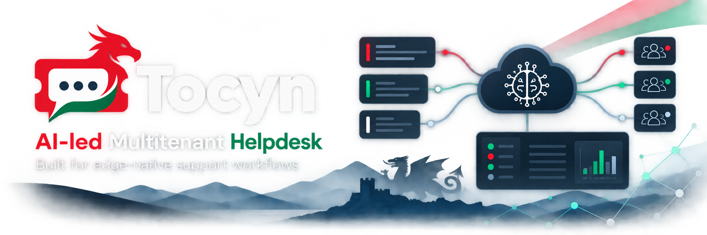
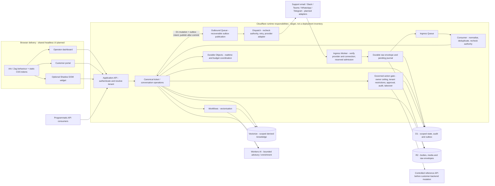

# Tocyn

[](LICENSE)
[](https://github.com/nathcymru/Tocyn/wiki/Architecture-and-tenant-isolation)
[](https://github.com/nathcymru/Tocyn/actions/workflows/ci.yml)
[](https://github.com/nathcymru/Tocyn/security/code-scanning)
[](https://github.com/sponsors/nathcymru)

**Tocyn** (Welsh for “ticket”, pronounced roughly “Tock-in”) is an open-source, multi-tenant helpdesk/support system built for Cloudflare's edge application stack. It is a fork of [Luminatick](https://github.com/05ng/luminatick) and is released under the MIT licence.

> **Pre-release:** Tocyn has no stable release and no project-operated hosted helpdesk service. Current source is under active development. Do not treat the repository, roadmap or documentation as evidence of production readiness.

Tocyn is being built as an omnichannel, multi-tenant helpdesk: service users contact support through a portal, embedded widget, programmatic API or external channel, while human operators work in one canonical conversation workspace. Bounded AI assistance and governed autonomous workflows extend that shared model; they do not create a separate helpdesk or bypass human control.

## Approved target architecture

**Approved / planned target, not a claim that every component is implemented or deployed.** The principal diagram shows the accepted system boundaries. The delivery-status section below identifies the current foundations and remaining work.



The dashboard, portal and optional widgets share planned Ark/Zag behavioural primitives with extendable TypeScript interfaces, static CSS and standard `--tocyn-*` custom properties. Tenant tokens apply at the document/container boundary; the Web Component wrapper isolates widget CSS in Shadow DOM while exposing the defined token API. Standalone operation never requires custom-element registration. Browser UI stays outside API Worker bundles; runtime CSS-in-JS is forbidden (#48/#66/#67).

API consumers authenticate at the application API. Support email, Slack, Teams, WhatsApp and Telegram enter through verified provider/connection adapters. Ingress reserves capacity, durably records bounded raw envelopes and a recoverable journal, then acknowledges using provider-specific semantics. Queues carry compact references to a consumer that normalises and deduplicates before canonical ticket/conversation writes. D1 owns scoped relational state, audit and transactional outbound intent; R2 owns bodies/media/raw content. Recoverable outbox publication feeds a separate dispatch responsibility for provider replies, bounded retries and authority rechecks (#51/#87/#88/#91).

These are distinct application API, edge-ingress, asynchronous-consumer and outbound-dispatch runtime responsibilities, not one synchronous Worker request. The accepted work establishes their contracts and Queue boundaries; it does **not** yet fix a deployment-wide Worker count or mandate particular Worker-to-Worker Service Binding/RPC wiring. Any direct internal service call must preserve verified tenant/correlation context and recheck the receiving operation's authority; a service boundary or tenant path is never permission by itself. Resource placement and concrete binding choices remain implementation decisions within those contracts.

Durable Objects supply realtime coordination and approved quota coordination, never memory-only durable acceptance. Workers AI and Vectorize support bounded enrichment/knowledge assistance, with Workflows for vectorisation. Persist accepted content before optional AI. Governed operations additionally require the deployment-owner ceiling, tenant restrictions, operation-bound approval where required, verification, attributable audit and takeover fencing; the first mutation proof uses the controlled reference API (#80–#83, ADR-0010). No diagram arrow grants cross-tenant data access or autonomous authority.

Target authority: [headless primitives #48](https://github.com/nathcymru/Tocyn/issues/48), [omnichannel tracker #49](https://github.com/nathcymru/Tocyn/issues/49), [durable ingress #51](https://github.com/nathcymru/Tocyn/issues/51), [consumer #87](https://github.com/nathcymru/Tocyn/issues/87), [dispatch #88](https://github.com/nathcymru/Tocyn/issues/88), [recovery #91](https://github.com/nathcymru/Tocyn/issues/91) and [accepted ADRs](https://github.com/nathcymru/Tocyn/wiki/Architecture-decision-records).

## Current status

The repository currently contains:

- a Hono/Cloudflare Worker API backend;
- operator dashboard, customer portal and embeddable widget applications;
- authentication, permissions, ticket/conversation and knowledge-base foundations;
- D1-backed application state;
- R2-backed attachment/offloaded-body storage;
- tenant-keyed Durable Object real-time coordination;
- Workers AI + Vectorize knowledge/AI-assistance foundations;
- an injectable email transport with Resend configuration;
- Phase 1 application-enforced tenant ownership/isolation changes in source.

The first planned test outcome is a **human-led API/portal private beta**, forecast for **21 November 2026**, candidate `v0.4.0-beta.1`. That prerelease has not been created. Slack, support-email expansion and governed autonomous customer-backend actions follow in later roadmap work.

The approved roadmap distinguishes **implemented source**, **beta/environment validation**, and **production readiness**. A feature appearing in an issue or architecture document does not mean it is already deployed.


Read the detailed [target architecture and current runtime evidence](docs/architecture/system-overview.md).

## Multi-tenancy and security

Tocyn's core invariant is that a tenant ID supplied in a URL, payload, webhook or automation rule is **not authority**. Request-driven data/storage operations must use a verified tenant scope and scoped repositories/storage adapters.

Phase 1 migrations qualify core ownership records by tenant, including users, groups, tickets, articles, attachments, memberships and support-email configuration. R2/Vectorize side effects are also treated as tenant-owned derived/external state rather than being authorised by raw object/vector identifiers.

See:

- [Data and tenant boundaries](docs/architecture/data-and-tenant-boundaries.md)
- [Security policy](SECURITY.md)
- [Multitenancy implementation/review evidence](docs/architecture/multitenancy/)

Please report vulnerabilities privately under [SECURITY.md](SECURITY.md).

## Channels and conversations

Tocyn uses a canonical ticket/conversation model. External providers are intended to be adapters around that core rather than separate helpdesk implementations.

Current beta sequencing is intentionally conservative:

1. prove API/portal canonical conversations and human operation;
2. add shared adapter/dispatch infrastructure and Slack;
3. expand support email and other approved external channels;
4. introduce governed autonomous resolution only after the human fallback, policy gate and audit controls are proven.

See [Channel adapter architecture](docs/architecture/channel-adapters.md).

## AI and autonomous operations

Current AI facilities are advisory/knowledge-oriented: embeddings, knowledge-grounded responses and suggested replies. Tocyn does **not** currently give AI standing authority over customer backend systems.

Approved future autonomous actions are policy-gated:

`deployment-owner authority ceiling → tenant restriction → runtime policy → allow / human approval / deny`

The first write-capability proof will use an isolated reference API before any real customer backend becomes a dependency. See [AI and autonomous operations](docs/architecture/ai-and-autonomous-operations.md).

## Privacy engineering

The Tocyn project does not operate a hosted customer helpdesk and does not automatically receive application-level data from independent Tocyn deployments. Repository/community touchpoints are covered by [PRIVACY_POLICY.md](PRIVACY_POLICY.md).

The roadmap includes future FidesLang privacy-as-code metadata under issues #16/#17. **FidesLang declarations are not yet present in the inspected `main` branch.** When implemented, the metadata is intended to describe data categories/subjects/uses for privacy tooling; it will not replace authentication, authorisation or tenant isolation.

Technical privacy documentation:

- [Privacy architecture](docs/privacy/privacy-architecture.md)
- [GDPR deployer technical guide](docs/privacy/gdpr-compliance-user-guide.md)

Using Tocyn or future FidesLang metadata does not by itself make a deployment GDPR-compliant. Independent deployers remain responsible for their own legal roles, configurations, processing purposes, retention, notices, contracts and operational compliance.

## Repository layout

```text
apps/                 Application workspaces
packages/             Shared runtime packages
public/               Public assets and application icon package
docs/                 Architecture, privacy, security and operational docs
.agents/              Vendor-neutral agent skills/workflows/resources/state
.github/               GitHub workflows/templates/Copilot shim
tools/                 Development tooling
scripts/               Utility scripts
```

GitHub-standard files such as `README.md`, `LICENSE`, `SECURITY.md`, `CONTRIBUTING.md`, `CODE_OF_CONDUCT.md`, `PRIVACY_POLICY.md` and `AGENTS.md` intentionally remain at repository root.

See [Repository structure](docs/repository-structure.md) and [Documentation index](docs/README.md).

## Application icons and brand assets

- canonical public brand assets: [`public/assets/brand/`](public/assets/brand/)
- platform application icon package: [`public/app_icons/`](public/app_icons/)

Do not reintroduce loose root image copies solely for README/Page compatibility; repository references should use the canonical public asset paths.

## Development

This is an npm workspace. Start with the current [contributor instructions](CONTRIBUTING.md) rather than historical phase documents.

See [CONTRIBUTING.md](CONTRIBUTING.md) and [`AGENTS.md`](AGENTS.md) for contribution and coding-agent governance. Repository work is issue-owned, PR-delivered, and uses persistent progress/completion receipts so the roadmap remains a living record.

## Roadmap

Current architectural milestones are capability-based rather than version-based:

| Phase | Focus |
| --- | --- |
| M0 | Engineering, platform/cost controls and delivery environments |
| M1 | Core data, intake, ticket-feed validation and transactional mail |
| M2 | Human workspace, composer/productivity, real-time state and design system |
| M3 | Context aggregation, triage/summarisation and operator AI assistance |
| M4 | Tool boundaries, governed autonomous resolution and human handoff |
| M5 | Authorisation, audit/oversight, analytics, privacy metadata and workflow administration |
| M6 | Portal/service-user experience, SLA, cross-channel continuity and deterministic self-service |
| M7 | WhatsApp, Telegram, Slack, Teams and support-email integrations |

Milestones describe architecture/capability completion. Releases are separate Git tags/GitHub Releases. `beta-blocker` is a cross-cutting readiness label rather than a milestone.

- [Approved architectural roadmap](https://github.com/nathcymru/Tocyn/wiki/Approved-architectural-roadmap)
- [Repository roadmap pointer](docs/roadmap.md)
- [Architecture decision records](docs/adr/README.md)

## Contributors

Thanks to everyone helping build, test, document and review Tocyn.

[](https://github.com/nathcymru/Tocyn/graphs/contributors)

See [CONTRIBUTORS.md](CONTRIBUTORS.md) for the contributor overview and [CONTRIBUTING.md](CONTRIBUTING.md) to get involved.

## Support Tocyn

Tocyn is free and open source. Optional GitHub sponsorship helps cover project-related hosting, documentation, testing and development-service costs.

Monthly tiers are **$1**, **$3**, and **$5**. Every tier supports the same open-source project; sponsorship does not buy private features, roadmap priority, an SLA or a hosted Tocyn service.

[](https://github.com/sponsors/nathcymru)

See [SPONSORS.md](SPONSORS.md) or [sponsor `nathcymru` on GitHub](https://github.com/sponsors/nathcymru).

## Public project page

The repository's GitHub Pages project page is: https://nathcymru.github.io/Tocyn/

It is a project/contributor information surface, **not** a hosted Tocyn application. Do not submit credentials, customer/tenant data or vulnerability details through its public contact form.

## Licence and upstream attribution

Tocyn is provided under the [MIT License](LICENSE), including its “AS IS” warranty disclaimer. The upstream Luminatick attribution/licence history is preserved in the repository.

Tocyn is an independent open-source project and is not affiliated with or endorsed by Cloudflare, GitHub, Ethyca/Fides or the external channel providers referenced by its roadmap.
