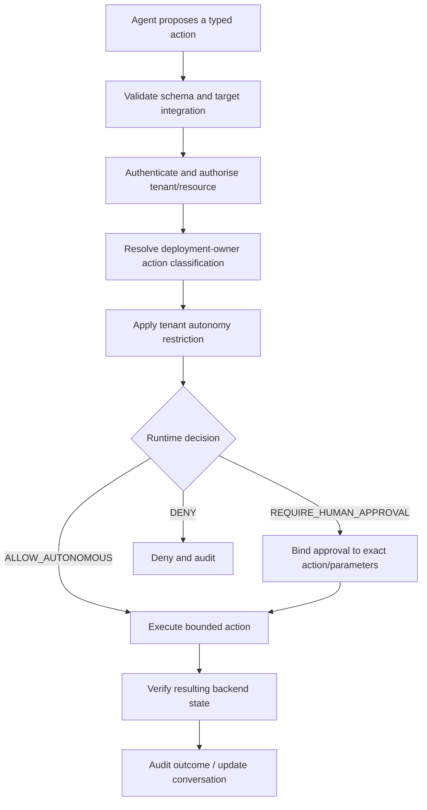

# AI and autonomous operations

## Current implementation

Current Tocyn AI facilities are knowledge/advisory capabilities. The Worker can generate embeddings and use Workers AI for knowledge-grounded answers or draft operator suggestions. Input is treated as untrusted and model failures fall back without granting additional authority.

Current AI code is **not** the future autonomous customer-backend operator. It does not create standing authority over external systems.

The accepted human-led AI direction is implementation pending: operator assistance stays inline with the conversation, context and composer, requires explicit acceptance, preserves provenance where applicable and leaves the complete human workflow available when AI is disabled or unavailable. It does not require API billing or extra spend for the operator workspace gate. See [ADR-0020](../adr/ADR-0020-human-led-ai-assistance.md).

## Approved future authority model

Autonomous operations will use policy-gated capabilities. Effective authority is bounded in this order:

`deployment-owner ceiling → tenant restriction → runtime context/policy decision → action`

A tenant may reduce authority that Tocyn is capable of exercising, but cannot expand beyond the deployment owner's permitted ceiling.

The prose equivalent is: an agent can propose an action, but every mutation must pass typed validation, integration authentication, tenant/resource authorisation, platform policy and tenant restriction. The policy gate returns autonomous execution, action-bound human approval, or denial. Successful execution is then independently verified where possible and auditable.

## Risk classes

The approved conceptual classes are:

- `READ_ONLY` — diagnostics/status retrieval where authorised;
- `LOW_RISK_WRITE` — explicitly approved, bounded, reversible/low-impact operations that may be autonomous;
- `PRIVILEGED_WRITE` — approval required by default;
- `DESTRUCTIVE` — explicit approval and stronger safeguards;
- `PROHIBITED` — never executable even if a tenant requests it.

Exact classifications belong to concrete tool definitions and deployment-owner policy; examples in documentation must not silently become permission grants.

## First validation target

The first policy-gated backend action will use an isolated **controlled reference API**, not a customer backend. That harness is intended to prove:

- typed tool boundaries;
- platform/tenant policy composition;
- allow/approval/deny outcomes;
- action-bound approvals;
- fail-closed behaviour;
- result verification;
- human takeover;
- audit evidence.

Only after that execution boundary is proven should a real customer-backend adapter become the next integration target.

## Human takeover

Human operation is the mandatory safe fallback. Taking over an agentic interaction must fence further autonomous mutation unless explicitly re-authorised. Current human-led API/portal beta work therefore precedes autonomous resolution on the release path.

## Audit model

Audit deterministic system evidence rather than hidden model reasoning. Relevant records include the tenant, actor/agent identity, integration/tool, requested action, material parameters or safe representation, classification, policy outcome, approval actor where applicable, execution/result verification, timestamp and failure/takeover events.

Secrets and unrelated tenant content must not be copied into audit records merely for observability.

## Roadmap

- M3 — enrichment, triage and operator AI assistance;
- M4 — tool boundaries, reference execution, autonomous loop and human handoff;
- M5 — authorisation, agent oversight/QA, operational analytics and workflow administration;
- M6.4 — authorised deterministic self-service actions.

These are approved future capabilities, not claims that unattended customer-backend mutation exists in the current `main` branch.

Autonomous M4 work remains separate from the published `v0.4.0-beta.1` and future operator-facing `beta.2`; the latter is gated by workspace continuity, full SLA/ownership/routing and human-led acceptance, not by autonomous execution.
