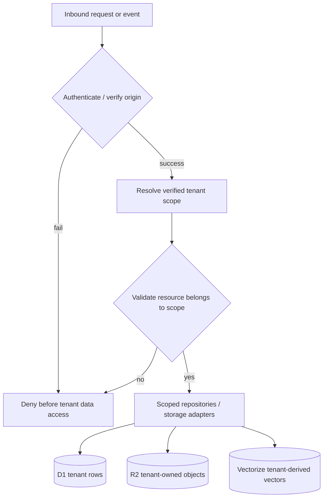

# Data and tenant boundaries

## Security invariant

Tenant identity is an authorisation property, not user-controlled routing metadata.

A trusted request path derives a verified tenant scope from authenticated credentials or a previously verified external-channel mapping. Path parameters, request bodies, webhook payloads, ticket identifiers and automation configuration cannot independently select another tenant.

The same rule applies whether the caller is a human operator, portal user, API key, automation rule or future AI operator.

The accepted workspace directions add drafts, attention state, activity, waiting/SLA state, linked context and feedback evidence without changing this invariant. Presentation state, presence, privacy metadata, URL state, routing labels and client preferences never establish authority. See [ADR-0018](../adr/ADR-0018-durable-operator-attention-and-continuity.md), [ADR-0022](../adr/ADR-0022-data-residency-and-storage-boundaries.md) and [ADR-0026](../adr/ADR-0026-access-identity-and-permission-boundaries.md).

## D1 ownership

The Phase 1 ownership migration changes core entities from globally identified records to tenant-qualified records. Current migration definitions include tenant-qualified users, groups, tickets, articles, attachments, user-group membership and support-email configuration. Composite foreign keys prevent a record from satisfying a relationship through another tenant's identifier.

Examples of tenant-owned application data include:

- users and authentication/account metadata;
- groups and assignment relationships;
- tickets and customer contact fields;
- message/article bodies and internal-note state;
- attachment metadata;
- support-email/channel configuration;
- tenant API/automation configuration added by subsequent migrations.

Repository and service code should use tenant-scoped repositories rather than raw database access for request-driven tenant operations.

## R2 ownership

R2 is used for attachments and, where offloaded, article bodies. Database ownership records retain the tenant relationship and the storage layer constrains access/deletion to the verified tenant path. A raw R2 key supplied by a request is not sufficient authority to read or delete an object.

## Vectorize ownership

Knowledge and QA material can generate derived vectors. Vector identifiers and metadata must remain attributable to the owning tenant/source record. Cleanup cannot stop at deleting D1 rows: retention logic must also remove related R2 objects and derived vectors where the manifest says they exist.

Current retention code deliberately preserves database ownership records until external deletions succeed, allowing safe retry rather than creating orphaned data with no cleanup manifest.

## Durable Object boundary

The real-time endpoint verifies an operator/admin session before constructing trusted internal headers. The Durable Object instance is keyed using `tenant:<tenant_id>`, giving each tenant a separate coordination namespace for active notification/WebSocket state.

## Tenant isolation versus privacy metadata

Access control and tenant isolation are security controls. Future FidesLang metadata is descriptive privacy-as-code metadata. A missing, disabled or malformed privacy declaration must never make an otherwise unauthorised tenant/resource operation possible.

This separation is formalised in [Privacy architecture](../privacy/privacy-architecture.md) and [SECURITY.md](../../SECURITY.md).

## Validation expectations

Changes touching tenant-owned state should demonstrate, as applicable:

- positive same-tenant behaviour;
- cross-tenant denial using colliding identifiers;
- malformed/missing authority denial;
- no data/storage side effect on rejected requests;
- tenant-scoped cleanup/retry behaviour;
- audit evidence without leaking credentials or unrelated tenant content.

Future workspace validation must additionally cover draft/notification/search/count/context isolation, authority-change cleanup, mixed-authority batch handling and linked-channel identity verification. These are planned acceptance requirements, not current production evidence.
