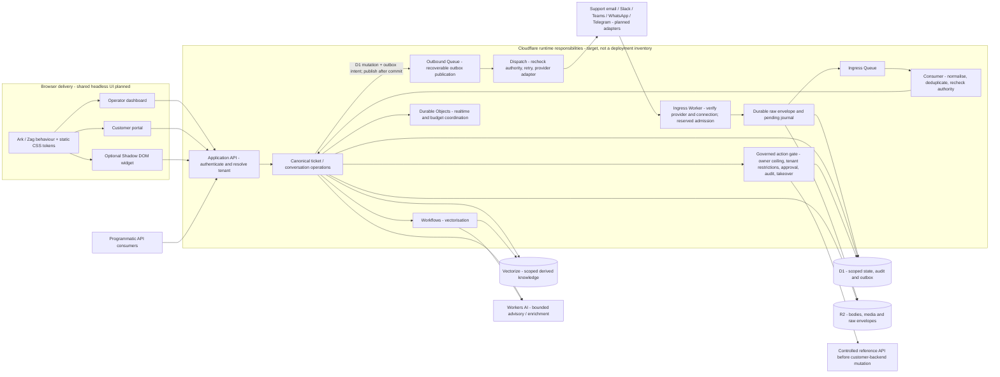
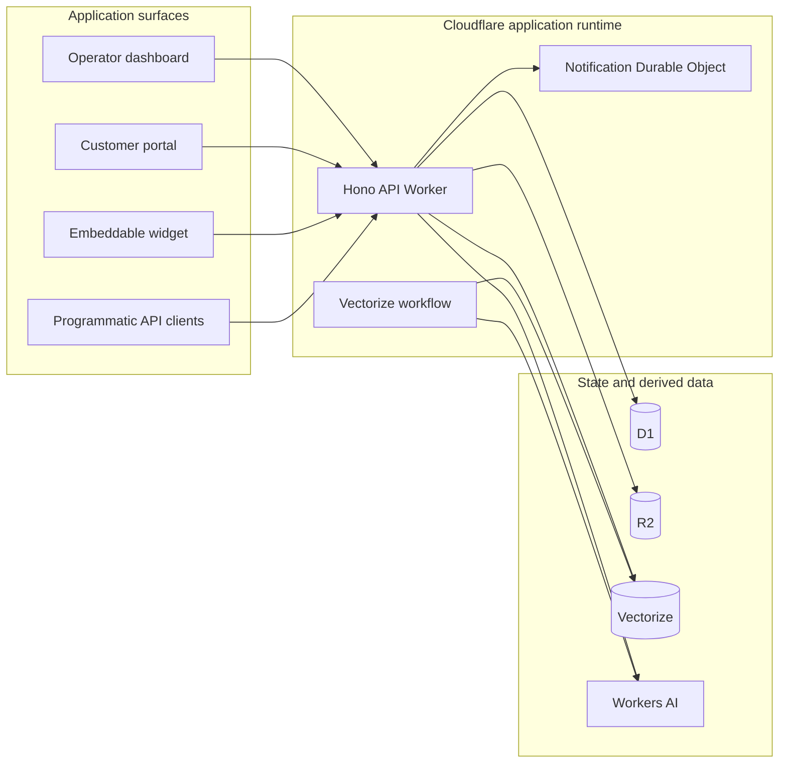

# System overview

Tocyn is being built as an omnichannel, multi-tenant helpdesk: service users contact support through a portal, embedded widget, programmatic API or external channel, while human operators work in one canonical conversation workspace. Bounded AI assistance and governed autonomous workflows extend that shared model; they do not create a separate helpdesk or bypass human control.

The accepted post-beta direction is implementation pending. ADR-0016 through ADR-0028 define the product boundary, persistent workspace, durable attention, cognitive accessibility, human-led AI, observability, residency, realtime collaboration, governed applets, contextual knowledge, access boundaries, linked workflow and feedback evidence. These decisions do not imply that the corresponding features, external providers or remote resources exist.

## Approved target architecture

**Approved / planned target, not a claim that every component is implemented or deployed.** The principal diagram shows the accepted system boundaries. The delivery-status section below identifies the current foundations and remaining work.

The dashboard, portal and optional widgets share planned Ark/Zag behavioural primitives with extendable TypeScript interfaces, static CSS and standard `--tocyn-*` custom properties. Tenant tokens apply at the document/container boundary; the Web Component wrapper isolates widget CSS in Shadow DOM while exposing the defined token API. Standalone operation never requires custom-element registration. Browser UI stays outside API Worker bundles; runtime CSS-in-JS is forbidden (#48/#66/#67).

API consumers authenticate at the application API. Support email, Slack, Teams, WhatsApp and Telegram enter through verified provider/connection adapters. Ingress reserves capacity, durably records bounded raw envelopes and a recoverable journal, then acknowledges using provider-specific semantics. Queues carry compact references to a consumer that normalises and deduplicates before canonical ticket/conversation writes. D1 owns scoped relational state, audit and transactional outbound intent; R2 owns bodies/media/raw content. Recoverable outbox publication feeds a separate dispatch responsibility for provider replies, bounded retries and authority rechecks (#51/#87/#88/#91).

These are distinct application API, edge-ingress, asynchronous-consumer and outbound-dispatch runtime responsibilities, not one synchronous Worker request. The accepted work establishes their contracts and Queue boundaries; it does **not** yet fix a deployment-wide Worker count or mandate particular Worker-to-Worker Service Binding/RPC wiring. Any direct internal service call must preserve verified tenant/correlation context and recheck the receiving operation's authority; a service boundary or tenant path is never permission by itself. Resource placement and concrete binding choices remain implementation decisions within those contracts.

Durable Objects supply realtime coordination and approved quota coordination, never memory-only durable acceptance. Workers AI and Vectorize support bounded enrichment/knowledge assistance, with Workflows for vectorisation. Persist accepted content before optional AI. Governed operations additionally require the deployment-owner ceiling, tenant restrictions, operation-bound approval where required, verification, attributable audit and takeover fencing; the first mutation proof uses the controlled reference API (#80–#83, ADR-0010). No diagram arrow grants cross-tenant data access or autonomous authority.

Target authority: [headless primitives #48](https://github.com/nathcymru/Tocyn/issues/48), [omnichannel tracker #49](https://github.com/nathcymru/Tocyn/issues/49), [durable ingress #51](https://github.com/nathcymru/Tocyn/issues/51), [consumer #87](https://github.com/nathcymru/Tocyn/issues/87), [dispatch #88](https://github.com/nathcymru/Tocyn/issues/88), [recovery #91](https://github.com/nathcymru/Tocyn/issues/91) and [accepted ADRs](https://github.com/nathcymru/Tocyn/wiki/Architecture-decision-records).

## Delivery status

| Classification | Evidence / remaining work |
| --- | --- |
| **Implemented foundations** | Dashboard/portal/widget and Hono API; auth/permissions, tenant-qualified state, D1/R2, realtime Durable Object, Workers AI/Vectorize and vectorisation Workflow; injectable mail transport. This is source evidence, not production clearance. |
| **In progress / remaining acceptance** | Phase 1 tenant ownership has merged implementation; #19 retains cross-tenant acceptance work. A merged foundation is not completion of the wider target. |
| **Approved / planned; not yet implemented as the target** | Ark/Zag migration, tenant token API and reusable Shadow DOM wrapper; shared durable ingress/Queues/consumer/outbox; external adapters and canonical cross-channel continuity; governed autonomous reference execution. |
| **Separate deployment gates** | Isolated beta environments/rehearsal and production readiness. Provider setup and infrastructure deployment are not implied by source, ADRs or this diagram. |

The local human-led beta was accepted on 9 September 2026 at `049ea82a02571681f834bcd87d43253603edf71f` and published as prerelease `v0.4.0-beta.1` on 10 September 2026. The next operator-facing `beta.2` remains future and requires the approved workspace gate, including full SLA clocks/pause-resume, waiting treatment and responsible-handler ownership/routing. This does not remove later channels or headless UI from the approved architecture.

## Current implementation / runtime

Tocyn is pre-release software. The current repository contains a working Hono-based Cloudflare Worker backend plus dashboard, portal and widget frontends. Phase 1 application-enforced tenant ownership has been implemented in source and reviewed, but isolated beta deployment and production cutover remain separate roadmap gates.

### Current entry points and bindings

The API Worker exposes authentication, permissions, knowledge, settings/channels, dashboard/operator, customer portal, widget and programmatic v1 routes. It also owns the inbound-email handler, scheduled retention entry point, real-time WebSocket upgrade and the Vectorize workflow.

Current Worker bindings include:

- **D1** — relational application records;
- **R2** — attachments and offloaded article bodies;
- **Durable Objects** — tenant-keyed operator notification/WebSocket coordination;
- **Vectorize** — knowledge/QA vectors;
- **Workers AI** — embeddings and advisory answer/suggestion generation;
- **Cloudflare Workflows** — vectorization workflow;
- **Resend transport configuration** — current transactional/authentication and email delivery dependency where configured.

There is currently **no Cloudflare Queue binding and no Cloudflare Calls binding** in `apps/server/wrangler.json`. External messaging adapters such as Slack, Teams, WhatsApp and Telegram remain roadmap work rather than current runtime claims.

The diagram shows arrangement, not trust. Every path that operates on tenant-owned state must first derive a verified tenant scope from authenticated authority; a tenant identifier in a URL, payload or stored rule is not authority by itself.

## Application flow

A normal human-operated support path is intended to remain channel-independent at its core:

1. an authenticated portal/API/widget or verified external adapter supplies an interaction;
2. Tocyn resolves the owning tenant and validates the request boundary;
3. the interaction is represented as Tocyn ticket/article state;
4. an operator works from the dashboard and replies;
5. the reply is persisted and returned through the appropriate portal/API/channel path;
6. attributable events, delivery/retry state and derived-data cleanup are retained according to the relevant capability.

The first private beta intentionally proves the API/portal version of this flow before Slack or autonomous backend execution becomes a release dependency.

## Current AI boundary

Current AI code is advisory/stateless at the model call boundary: it generates embeddings, suggested operator responses and knowledge-grounded responses. It does not provide the approved future policy-gated customer-backend mutation framework. The latter is M4 work and must pass deployment-owner policy, tenant restriction, validation, approval where required, audit and takeover controls.

The accepted human-led AI direction keeps assistance in the existing conversation/context/composer surfaces, with explicit operator acceptance and a complete AI-off path. It does not require API billing or extra spend as part of the workspace gate.

## Planned operator-state boundary

Drafts, snooze/resurface, waiting reasons, SLA clocks, responsible-handler routing, durable activity and collision state are additive to canonical ticket/conversation state. They must use authenticated tenant/user-scoped storage and server authority. Realtime signals invalidate or notify; they are not the source of truth. Capacity-aware routing, external applets and provider-specific integrations remain separate implementation increments over these contracts.

## Deployment status

Repository configuration names inherited Cloudflare resources from the upstream Luminatick project. Those names are not evidence of a production Tocyn deployment. Environment isolation, resource renaming/provisioning and production readiness are governed by M0.3/M0.4 and must be verified against the actual Cloudflare account before operational use.

## Related documents

- [Data and tenant boundaries](data-and-tenant-boundaries.md)
- [Channel adapters](channel-adapters.md)
- [AI and autonomous operations](ai-and-autonomous-operations.md)
- [Security policy](../../SECURITY.md)
- [Privacy architecture](../privacy/privacy-architecture.md)

## Residency source validation (#160)

The [deployment residency contract](https://github.com/nathcymru/Tocyn/blob/main/docs/deployment-residency.md) and preview/beta manifests now distinguish storage, HTTP, asynchronous, AI/provider and observability paths. Local release preparation validates these fields and carries them into its binding manifest. Current evidence is pending/unknown; no live jurisdiction guarantee or legal compliance is claimed. The current generator rejects hard profiles because its bindings do not implement jurisdiction-aware provisioning. Production #42 and future remote #57 must verify resource creation-time jurisdiction, processing paths and migration consequences before any constrained deployment. Tenant/request metadata cannot select a deployment region.
