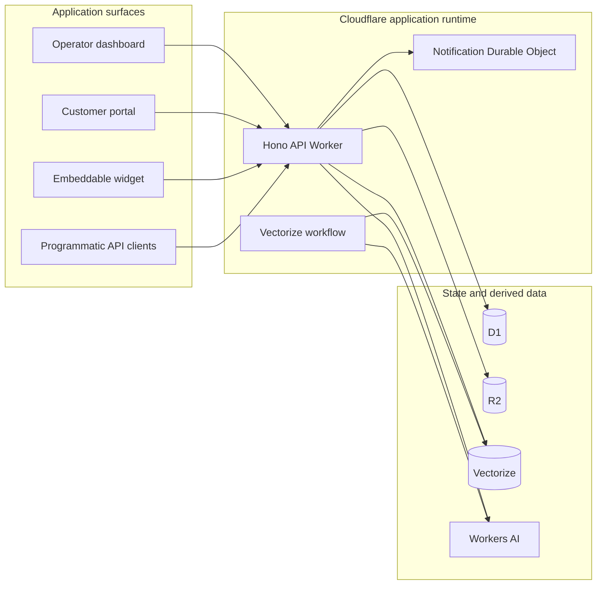

# System overview

## Status

Tocyn is pre-release software. The current repository contains a working Hono-based Cloudflare Worker backend plus dashboard, portal and widget frontends. Phase 1 application-enforced tenant ownership has been implemented in source and reviewed, but isolated beta deployment and production cutover remain separate roadmap gates.

## Implemented runtime

The API Worker exposes authentication, permissions, knowledge, settings/channels, dashboard/operator, customer portal, widget and programmatic v1 routes. It also owns the inbound-email handler, scheduled retention entry point, real-time WebSocket upgrade and the Vectorize workflow.

Current Worker bindings include:

- **D1** — relational application records;
- **R2** — attachments and offloaded article bodies;
- **Durable Objects** — tenant-keyed operator notification/WebSocket coordination;
- **Vectorize** — knowledge/QA vectors;
- **Workers AI** — embeddings and advisory answer/suggestion generation;
- **Cloudflare Workflows** — vectorization workflow;
- **Resend transport configuration** — current transactional/authentication and email delivery dependency where configured.

There is currently **no Cloudflare Queue binding and no Cloudflare Calls binding** in `apps/server/wrangler.json`. External messaging adapters such as Slack, Teams, WhatsApp and Telegram remain roadmap work rather than current runtime claims.

The diagram shows arrangement, not trust. Every path that operates on tenant-owned state must first derive a verified tenant scope from authenticated authority; a tenant identifier in a URL, payload or stored rule is not authority by itself.

## Application flow

A normal human-operated support path is intended to remain channel-independent at its core:

1. an authenticated portal/API/widget or verified external adapter supplies an interaction;
2. Tocyn resolves the owning tenant and validates the request boundary;
3. the interaction is represented as Tocyn ticket/article state;
4. an operator works from the dashboard and replies;
5. the reply is persisted and returned through the appropriate portal/API/channel path;
6. attributable events, delivery/retry state and derived-data cleanup are retained according to the relevant capability.

The first private beta intentionally proves the API/portal version of this flow before Slack or autonomous backend execution becomes a release dependency.

## Current AI boundary

Current AI code is advisory/stateless at the model call boundary: it generates embeddings, suggested operator responses and knowledge-grounded responses. It does not provide the approved future policy-gated customer-backend mutation framework. The latter is M4 work and must pass deployment-owner policy, tenant restriction, validation, approval where required, audit and takeover controls.

## Deployment status

Repository configuration names inherited Cloudflare resources from the upstream Luminatick project. Those names are not evidence of a production Tocyn deployment. Environment isolation, resource renaming/provisioning and production readiness are governed by M0.3/M0.4 and must be verified against the actual Cloudflare account before operational use.

## Related documents

- [Data and tenant boundaries](data-and-tenant-boundaries.md)
- [Channel adapters](channel-adapters.md)
- [AI and autonomous operations](ai-and-autonomous-operations.md)
- [Security policy](../../SECURITY.md)
- [Privacy architecture](../privacy/privacy-architecture.md)
