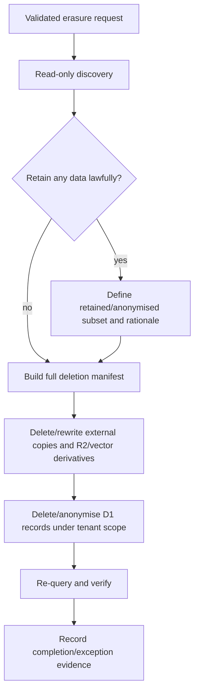

# GDPR compliance user guide

> **Technical guidance, not legal advice.** Tocyn does not make an independent deployment GDPR-compliant. The deployer is responsible for determining its legal role, lawful bases, notices, contracts, retention, security measures, rights-request decisions, records and any applicable exemptions. UK ICO guidance should be rechecked when handling a live request because privacy law/guidance changes.

## What this guide covers

This guide gives downstream Tocyn deployers a technical starting point for:

- Article 15 / subject-access discovery and export;
- Article 17 erasure/anonymisation planning;
- Article 30 records-of-processing-activities (RoPA) inventory;
- future use of Tocyn's planned FidesLang metadata.

As of 8 September 2026 the current `main` branch has no FidesLang declarations. Issues #16/#17 will add and validate that metadata. Until then, use the actual schema/storage inventory rather than assuming an automated privacy map exists.

## Before executing any rights request

A deployer should first:

1. verify the requester's identity and authority without collecting excessive new data;
2. establish the exact tenant and data-subject identifiers;
3. determine what law applies and whether any exemption, retention duty, third-party right or dispute affects disclosure/deletion;
4. record the request and decision;
5. run discovery using read-only, tenant-scoped queries;
6. review results before export or mutation;
7. include D1, R2, Vectorize and relevant external providers in the execution plan;
8. verify completion and preserve only the evidence the deployer is entitled/required to retain.

The UK ICO describes Article 15 access as the right to confirmation/copies of personal information plus supplementary information, and Article 17 erasure as a non-absolute right applying in specified circumstances. Article 30 documentation covers purposes, sharing, retention and other processing details. Refer to current ICO guidance before operational use.

## Article 15 — technical discovery pipeline

### Step 1: resolve the subject inside one tenant

Use parameterised queries through an authenticated administrator/privacy workflow. Never interpolate user input into SQL.

```sql
-- Example only: run against the deployer's own D1 and verified tenant.
SELECT tenant_id, id, email, full_name, role, last_active_at, created_at, last_login_at
FROM users
WHERE tenant_id = ?
  AND lower(trim(email)) = lower(trim(?));
```

Record the resulting `user.id` only after confirming it belongs to the verified tenant.

### Step 2: discover tickets

A person's email can also appear on tickets even if no user account exists, so search both customer ID and normalised customer email.

```sql
SELECT id, ticket_no, subject, status, priority, customer_id, customer_email,
       assigned_to, group_id, source, source_email, custom_fields,
       created_at, updated_at
FROM tickets
WHERE tenant_id = ?
  AND (
       customer_id = ?
       OR lower(trim(customer_email)) = lower(trim(?))
  )
ORDER BY created_at;
```

### Step 3: discover messages/articles

```sql
SELECT id, ticket_id, sender_id, sender_type, body, body_r2_key, snippet,
       raw_email_id, qa_type, chunk_count, is_internal, created_at
FROM articles
WHERE tenant_id = ?
  AND ticket_id IN (/* verified ticket IDs from the same tenant */)
ORDER BY ticket_id, created_at;
```

Do not disclose internal notes, other people's personal information, secrets or privileged material merely because the SQL returned it. The deployer must apply the applicable disclosure rules before producing the response.

### Step 4: discover attachments and external bodies

```sql
SELECT id, article_id, file_name, file_size, content_type, r2_key, created_at
FROM attachments
WHERE tenant_id = ?
  AND article_id IN (/* verified article IDs */);
```

For articles with `body_r2_key` and attachment `r2_key` values, retrieve bytes only through tenant-scoped storage code/credentials. A raw object key is not authorisation.

### Step 5: derived/external systems

Review whether the subject's information has also reached:

- Vectorize/knowledge or QA-derived chunks;
- support-email providers and message delivery metadata;
- future Slack/Teams/WhatsApp/Telegram adapters;
- configured webhooks/RMM or other tenant integrations;
- deployment logs, backups and monitoring systems.

Those systems are deployment-specific and cannot be inferred solely from Tocyn's D1 database.

### Suggested export manifest

Rather than dumping raw tables, create a reviewable manifest such as:

```json
{
  "tenant": "verified-tenant-id",
  "subject": { "user_id": "...", "email": "..." },
  "records": {
    "account": 1,
    "tickets": 4,
    "articles": 18,
    "attachments": 3,
    "r2_objects": 5,
    "derived_vector_sets": 2,
    "external_systems_reviewed": ["mail-provider"]
  },
  "review_status": "requires human disclosure review"
}
```

This manifest is an operational aid, not the Article 15 response itself.

## Article 17 — erasure/anonymisation pipeline

The right to erasure is not absolute. Do **not** turn the following into an automatic "delete by email" endpoint. A human/legal policy decision must precede mutation.



The diagram means: discover first, determine what must be retained, construct a manifest, handle external/derived copies, mutate D1 only under verified tenant scope, then verify and record the outcome.

### Use Tocyn's retention design as the deletion pattern

Current retention code intentionally retains database ownership records while deleting R2/vector side effects. This avoids deleting the only cleanup manifest before an external deletion succeeds. A DSAR/erasure implementation should use the same property: **do not lose the authoritative list of external objects before their deletion has been verified.**

### Safer transaction skeleton

The exact SQL depends on the controller's retention decision and referential requirements. A controlled implementation might conceptually do:

```sql
BEGIN TRANSACTION;

-- After external-object cleanup is verified and the authorised plan says
-- the rows may be erased/anonymised, operate only within tenant_id = ?.

-- Example anonymisation where ticket history must be retained:
UPDATE tickets
SET customer_id = NULL,
    customer_email = 'erased-subject@invalid.example',
    source_email = NULL
WHERE tenant_id = ?
  AND id IN (/* approved ticket IDs */);

-- Account deletion must account for same-tenant references first.
DELETE FROM users
WHERE tenant_id = ? AND id = ?;

COMMIT;
```

This is intentionally **not** a complete deletion script. Blind cascading deletion could destroy records the controller is required to retain, another person's data, audit evidence, or records still referenced by R2/vector manifests. Implement a tested domain service rather than exposing arbitrary SQL to operators.

## Planned FidesLang-assisted rights discovery

When #16/#17 are implemented, privacy metadata should reduce manual inventory work by mapping fields/stores to data categories, data subjects and uses. A future orchestrator could:

1. parse validated Tocyn FidesLang declarations;
2. identify schema/storage locations tagged for the relevant subject/category;
3. bind those locations to tenant-scoped adapters;
4. generate a candidate access/erasure plan;
5. require the deployer's legal/authorisation decision before execution;
6. verify every downstream result.

FidesLang metadata must not itself confer database credentials or tenant authority.

## RoPA starter inventory

This table is a **technical inventory seed**, not a completed Article 30 record. A deployer must add its own purposes, lawful bases, recipients, international transfers, retention periods, safeguards and local integrations.

| Tocyn data area | Typical fields/content | Likely data subjects | Storage/processing locations | Notes for deployer RoPA |
| --- | --- | --- | --- | --- |
| User/account identity | email, full name, account ID, role | operators, admins, customers | D1 | Define account-management/authentication purpose and retention. |
| Authentication/security | password hash, MFA secret/state, session/revocation metadata, login/activity times | users | D1 + runtime/security logs | Credentials/secrets require strong access controls; do not export secret material in ordinary SAR output. |
| Groups/authorisation | group membership, roles, permissions | staff/users | D1 | Security purpose; may reveal organisational relationships. |
| Ticket identity/metadata | subject, status, priority, customer ID/email, assignee, group, source, timestamps, custom fields | customers, staff, other correspondents | D1 | Custom/free-text fields can contain unexpected categories. |
| Conversation content | message/article body, snippet, sender, internal-note flag, timestamps | customers, staff, third parties mentioned in text | D1 and/or R2 | Free text may contain special-category or third-party data even though Tocyn does not require it. |
| Attachments | filename, type, size and file contents | any person represented in an upload | D1 metadata + R2 bytes | Contents are uncontrolled user data; define retention and malware/security handling. |
| Support-email/channel data | support address, sender/recipient/provider IDs, raw-message/thread identifiers | correspondents, staff | D1 + provider systems | Provider retention and international-transfer position are deployment-specific. |
| API/automation configuration | API-key metadata, rule conditions/actions, webhook targets/config | admins/operators; sometimes embedded contact data | D1 | Secrets should be protected and excluded from unnecessary privacy exports. |
| Knowledge content | documents, QA content, chunks, titles, source files | authors; persons mentioned in content | D1/R2/Vectorize/Workers AI processing | Tenant controls what is ingested; inspect for personal data before indexing. |
| AI/derived data | embeddings, prompts/context used for suggestions/responses | persons represented in source content | Workers AI + Vectorize | Record purpose, provider/runtime and retention/derivation model. |
| Operational/audit data | timestamps, actions, actor IDs, request/security metadata | users/operators | D1/provider logs depending deployment | Define security/accountability retention separately from ticket retention. |

### Special-category data

Tocyn's base schema does not require health, biometric, political, religious or other special-category fields. However, free-text tickets, messages, custom fields, knowledge documents and attachments can contain any information users submit. A deployer must therefore assess the **actual content and use**, not only column names.

## Security boundary

Privacy administration must use the same or stronger authentication/authorisation/tenant-isolation controls as ordinary administration. A privacy UI or script must never accept an email address, FidesLang tag or tenant path as sufficient authorisation.

Report unsafe privacy endpoints, cross-tenant disclosure or exposed policy/configuration through [SECURITY.md](../../SECURITY.md).

## Records and validation checklist

For each operational rights request, the deployer should be able to evidence:

- requester identity/authority verification;
- tenant selection derived from trusted authority;
- decision and any exemptions/retained categories;
- systems searched;
- records found;
- disclosures/redactions or deletion/anonymisation actions;
- R2/vector/external-provider outcomes;
- failures/retries;
- completion verification;
- responsible human and timestamps.

Do not store more requester information in that evidence than is necessary for accountability.

## Current external references

For UK deployments, recheck current ICO guidance on:

- Right of access / subject access requests: https://ico.org.uk/for-organisations/uk-gdpr-guidance-and-resources/individual-rights/right-of-access/
- Right to erasure: https://ico.org.uk/for-organisations/uk-gdpr-guidance-and-resources/individual-rights/individual-rights/right-to-erasure/
- Article 30 documentation/RoPA: https://ico.org.uk/for-organisations/uk-gdpr-guidance-and-resources/accountability-and-governance/documentation/

See also [Privacy architecture](privacy-architecture.md).
