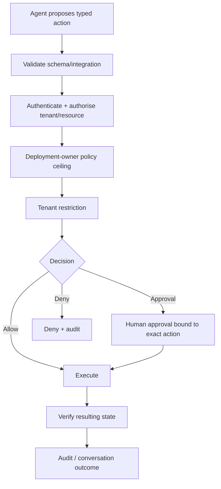

# AI and autonomous operations

## Current AI

Current Tocyn AI code provides embeddings, knowledge-grounded responses and draft/operator suggestions through Workers AI. It is advisory/knowledge-oriented and does **not** give an AI standing authority over customer backend systems.

## Approved policy-gated model

In prose: every future external mutation must pass typed validation, integration authentication, tenant/resource authorisation, platform policy and tenant restriction. The result is autonomous execution, action-specific human approval, or denial. Execution is verified and audited.

## Authority

Tenant administrators may reduce permitted autonomy but cannot exceed the deployment-owner ceiling. Privileged/destructive actions require approval by default; prohibited actions remain prohibited. Unknown policy state fails closed.

## First backend-action proof

The first governed action uses an isolated controlled reference API. It proves permissions, approvals, execution, verification, denial and takeover before a real customer backend becomes a dependency.

## Human fallback

Human operation is the mandatory fallback. The first private beta is human-led, and takeover must fence further autonomous mutation until explicitly re-authorised.

Repository detail: [`docs/architecture/ai-and-autonomous-operations.md`](https://github.com/nathcymru/Tocyn/blob/main/docs/architecture/ai-and-autonomous-operations.md).
