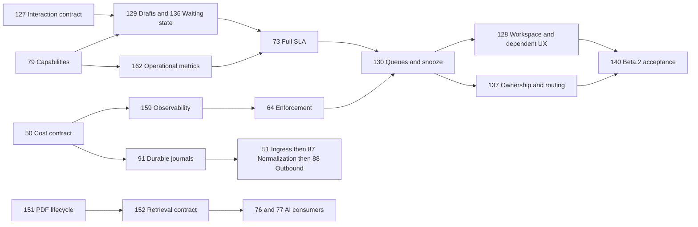

# Approved architectural roadmap

The owner-approved 10 September baseline supersedes earlier sequencing. Start with [[Post-beta-master-baseline]].

## Current calculated forecast

Forecast anchor: **2026-09-11**. Beta.2 gate forecast: **2027-01-22**. Expanded scope forecast: **2028-01-21**. These are calculated conservative capacity forecasts, not promises of releases or remote approval.

Two lanes, 8h/day Monday–Saturday; 2.5× baseline implementation and 0.5× shared 4h/day review/integration. A lane remains occupied through integration. Dependencies become available the following working day. External approval/provider waits are unknown, not zero-duration guarantees. Actual concurrency may exceed this reference model.

Dependency-only critical network length: 1134 planning hours. Resource-constrained calendar dates differ from this analytical lower bound. Near-critical means positive float ≤48h.

| Issue | Remaining 3× hours | Lane | Forecast | Prerequisites |
|---|---:|---|---|---|
| [#48](https://github.com/nathcymru/Tocyn/issues/48) Establish shared headless primitives for standalone Tocyn | 120 | W1 | 2026-09-11 → 2026-10-01 | #127 |
| [#129](https://github.com/nathcymru/Tocyn/issues/129) Persist operator drafts, selection and workspace continuity | 60 | W2 | 2026-09-11 → 2026-09-22 | #127, #60, #63, #79 |
| [#136](https://github.com/nathcymru/Tocyn/issues/136) Add explicit waiting reasons and configurable support workflow states | 72 | W2 | 2026-09-23 → 2026-10-05 | #127, #60, #63, #79 |
| [#66](https://github.com/nathcymru/Tocyn/issues/66) Apply tenant themes through standard CSS variables | 48 | W1 | 2026-10-02 → 2026-10-09 | #48 |
| [#159](https://github.com/nathcymru/Tocyn/issues/159) Establish operational observability and service-level objectives | 72 | W2 | 2026-10-06 → 2026-10-17 | #50, #63 |
| [#68](https://github.com/nathcymru/Tocyn/issues/68) Add a rich conversation composer | 72 | W1 | 2026-10-10 → 2026-10-22 | #48, #66, #129 |
| [#64](https://github.com/nathcymru/Tocyn/issues/64) Enforce resource budgets across active application paths | 48 | W2 | 2026-10-19 → 2026-10-26 | #50, #60, #93, #159 |
| [#70](https://github.com/nathcymru/Tocyn/issues/70) Add typing awareness and private colleague collaboration | 72 | W1 | 2026-10-23 → 2026-11-04 | #63, #68 |
| [#162](https://github.com/nathcymru/Tocyn/issues/162) Define operational metric contracts for SLA and routing | 24 | W2 | 2026-10-27 → 2026-10-30 | #63, #79 |
| [#73](https://github.com/nathcymru/Tocyn/issues/73) Expose SLA progress and responsible handlers | 72 | W2 | 2026-10-31 → 2026-11-12 | #61, #63, #136, #162 |
| [#91](https://github.com/nathcymru/Tocyn/issues/91) Recover accepted payloads through durable storage journals | 72 | W1 | 2026-11-05 → 2026-11-17 | #50, #59 |
| [#130](https://github.com/nathcymru/Tocyn/issues/130) Add task-based work queues and snooze/resurface | 72 | W2 | 2026-11-13 → 2026-11-25 | #129, #136, #73, #64 |
| [#51](https://github.com/nathcymru/Tocyn/issues/51) Implement authenticated durable webhook ingress | 72 | W1 | 2026-11-18 → 2026-11-30 | #50, #64, #91 |
| [#128](https://github.com/nathcymru/Tocyn/issues/128) Build the persistent progressive operator workspace | 96 | W2 | 2026-11-26 → 2026-12-11 | #127, #129, #130, #48, #66 |
| [#137](https://github.com/nathcymru/Tocyn/issues/137) Add workload-aware queues and operator capacity controls | 72 | W1 | 2026-12-01 → 2026-12-15 | #73, #79, #162, #130 |
| [#71](https://github.com/nathcymru/Tocyn/issues/71) Enable keyboard-first workspace navigation | 36 | W2 | 2026-12-12 → 2026-12-18 | #62, #66, #128 |
| [#132](https://github.com/nathcymru/Tocyn/issues/132) Add cognitive-accessibility workspace preferences and focus mode | 48 | W1 | 2026-12-16 → 2026-12-23 | #128, #66 |
| [#131](https://github.com/nathcymru/Tocyn/issues/131) Unify global search and scoped inbox filtering | 36 | W2 | 2026-12-19 → 2026-12-25 | #128, #71 |
| [#133](https://github.com/nathcymru/Tocyn/issues/133) Replace transient ticket toasts with durable operator activity | 48 | W1 | 2026-12-24 → 2026-12-31 | #128, #63, #70, #66 |
| [#134](https://github.com/nathcymru/Tocyn/issues/134) Add customer context and contextual support panels | 60 | W2 | 2026-12-26 → 2027-01-06 | #128, #132, #63 |
| [#135](https://github.com/nathcymru/Tocyn/issues/135) Add configurable Table view and safe bulk ticket actions | 48 | W1 | 2027-01-01 → 2027-01-08 | #128, #60, #64, #79 |
| [#138](https://github.com/nathcymru/Tocyn/issues/138) Define workspace utility actions for call, remote support and external tools | 36 | W2 | 2027-01-07 → 2027-01-13 | #128, #79 |
| [#139](https://github.com/nathcymru/Tocyn/issues/139) Measure operator interaction performance and enforce UI response budgets | 24 | W1 | 2027-01-09 → 2027-01-14 | #128, #48 |
| [#87](https://github.com/nathcymru/Tocyn/issues/87) Normalise provider events into reliable conversation state | 96 | W2 | 2027-01-14 → 2027-01-29 | #51, #59, #91 |
| [#140](https://github.com/nathcymru/Tocyn/issues/140) Validate the redesigned operator workspace for usability and cognitive accessibility | 48 | W1 | 2027-01-15 → 2027-01-22 | #128, #129, #130, #131, #132, #133, #134, #135, #136, #137, #138, #139, #48, #66, #68, #70, #71, #73, #79 |
| [#12](https://github.com/nathcymru/Tocyn/issues/12) Verify required checks on dependency-only pull requests | 24 | W1 | 2027-01-23 → 2027-01-30 |  |
| [#88](https://github.com/nathcymru/Tocyn/issues/88) Dispatch transactional outbound intents reliably | 72 | W2 | 2027-01-30 → 2027-02-11 | #63, #64, #87 |
| [#14](https://github.com/nathcymru/Tocyn/issues/14) Standardise repository formatting and lint conventions | 24 | W1 | 2027-02-01 → 2027-02-04 |  |
| [#16](https://github.com/nathcymru/Tocyn/issues/16) Establish measurable FidesLang coverage | 48 | W1 | 2027-02-05 → 2027-02-13 | #59, #91 |
| [#18](https://github.com/nathcymru/Tocyn/issues/18) Migrate transactional mail to Cloudflare-native delivery | 48 | W2 | 2027-02-12 → 2027-02-19 | #57 |
| [#17](https://github.com/nathcymru/Tocyn/issues/17) Complete FidesLang coverage and optional user controls | 72 | W1 | 2027-02-15 → 2027-02-26 | #16 |
| [#22](https://github.com/nathcymru/Tocyn/issues/22) Complete remaining repository launch administration | 18 | W2 | 2027-02-20 → 2027-02-23 | #65 |
| [#42](https://github.com/nathcymru/Tocyn/issues/42) Validate production cutover and rollback readiness | 48 | W2 | 2027-02-24 → 2027-03-03 | #65, #159, #160 |
| [#44](https://github.com/nathcymru/Tocyn/issues/44) Retire inactive services while preserving regression coverage | 24 | W1 | 2027-02-27 → 2027-03-04 | #14 |
| [#45](https://github.com/nathcymru/Tocyn/issues/45) Evaluate deferred major dependency and Actions upgrades | 24 | W2 | 2027-03-04 → 2027-03-08 | #12 |
| [#52](https://github.com/nathcymru/Tocyn/issues/52) Deliver signed tenant webhook subscriptions reliably | 48 | W1 | 2027-03-05 → 2027-03-12 | #50, #64, #88 |
| [#53](https://github.com/nathcymru/Tocyn/issues/53) Implement tenant-owned Slack support channels | 72 | W2 | 2027-03-09 → 2027-03-20 | #66, #87, #88 |
| [#54](https://github.com/nathcymru/Tocyn/issues/54) Implement tenant-owned Microsoft Teams support channels | 96 | W1 | 2027-03-13 → 2027-03-29 | #66, #87, #88 |
| [#55](https://github.com/nathcymru/Tocyn/issues/55) Implement tenant-owned WhatsApp messaging | 72 | W2 | 2027-03-22 → 2027-04-02 | #66, #87, #88 |
| [#56](https://github.com/nathcymru/Tocyn/issues/56) Implement tenant-owned Telegram support messaging | 48 | W1 | 2027-03-30 → 2027-04-06 | #66, #87, #88 |
| [#67](https://github.com/nathcymru/Tocyn/issues/67) Package isolated helpdesk Web Components | 72 | W2 | 2027-04-03 → 2027-04-15 | #48, #66 |
| [#69](https://github.com/nathcymru/Tocyn/issues/69) Add reusable responses and safe operator macros | 36 | W1 | 2027-04-07 → 2027-04-16 | #68 |
| [#72](https://github.com/nathcymru/Tocyn/issues/72) Split and merge tickets without losing context | 72 | W2 | 2027-04-16 → 2027-04-28 | #59, #63, #70 |
| [#74](https://github.com/nathcymru/Tocyn/issues/74) Preserve conversations across verified channel changes | 72 | W1 | 2027-04-17 → 2027-05-01 | #53, #61, #87 |
| [#75](https://github.com/nathcymru/Tocyn/issues/75) Enrich intake with authorised operational context | 72 | W2 | 2027-04-29 → 2027-05-11 | #64, #79 |
| [#80](https://github.com/nathcymru/Tocyn/issues/80) Validate governed actions against an isolated reference API | 120 | W1 | 2027-05-03 → 2027-05-22 | #63, #64, #79 |
| [#89](https://github.com/nathcymru/Tocyn/issues/89) Enable verified canonical support-email conversations | 72 | W2 | 2027-05-12 → 2027-05-26 | #57, #87, #88 |
| [#81](https://github.com/nathcymru/Tocyn/issues/81) Bind human approvals to specific proposed actions | 72 | W1 | 2027-05-24 → 2027-06-04 | #80 |
| [#90](https://github.com/nathcymru/Tocyn/issues/90) Expose owner and tenant Cost & Capacity controls | 72 | W2 | 2027-05-27 → 2027-06-08 | #50, #64, #66 |
| [#83](https://github.com/nathcymru/Tocyn/issues/83) Transfer live agentic work safely to human operators | 72 | W1 | 2027-06-05 → 2027-06-17 | #70, #80, #81 |
| [#49](https://github.com/nathcymru/Tocyn/issues/49) Track delivery of the omnichannel architecture | 6 | W2 | 2027-06-09 → 2027-06-10 | #51, #52, #53, #54, #55, #56, #74, #89, #90 |
| [#92](https://github.com/nathcymru/Tocyn/issues/92) Attach bounded telemetry to programmatic support intake | 48 | W2 | 2027-06-11 → 2027-06-19 | #60, #91 |
| [#86](https://github.com/nathcymru/Tocyn/issues/86) Expose authorised deterministic self-service actions | 72 | W1 | 2027-06-18 → 2027-06-30 | #61, #81, #83 |
| [#142](https://github.com/nathcymru/Tocyn/issues/142) Prove the Cloudflare Realtime support-session architecture | 72 | W2 | 2027-06-21 → 2027-07-03 | #50, #74, #79, #87, #88, #90 |
| [#149](https://github.com/nathcymru/Tocyn/issues/149) Create linked back-office work items without exposing customer conversations | 96 | W1 | 2027-07-01 → 2027-07-16 | #70, #72, #79 |
| [#143](https://github.com/nathcymru/Tocyn/issues/143) Model tenant-scoped realtime support sessions and media permissions | 120 | W2 | 2027-07-05 → 2027-07-24 | #142, #50, #64, #74, #79 |
| [#150](https://github.com/nathcymru/Tocyn/issues/150) Track service problems and incidents across affected conversations | 120 | W1 | 2027-07-17 → 2027-08-06 | #149, #72, #79, #88 |
| [#144](https://github.com/nathcymru/Tocyn/issues/144) Add browser voice, video and screen-sharing support sessions | 144 | W2 | 2027-07-26 → 2027-08-18 | #143, #48, #68, #70, #74 |
| [#145](https://github.com/nathcymru/Tocyn/issues/145) Implement a tenant-owned telephony gateway for inbound and outbound calls | 144 | W1 | 2027-08-07 → 2027-08-31 | #142, #143, #74, #79, #87, #88, #90 |
| [#147](https://github.com/nathcymru/Tocyn/issues/147) Record and transcribe support sessions under tenant policy | 120 | W2 | 2027-08-19 → 2027-09-08 | #143, #50, #90 |
| [#146](https://github.com/nathcymru/Tocyn/issues/146) Add voicemail, callback, transfer and call-queue operations | 120 | W1 | 2027-09-01 → 2027-09-21 | #145, #70, #73, #79 |
| [#151](https://github.com/nathcymru/Tocyn/issues/151) Ingest tenant PDF knowledge with lifecycle-safe provenance | 96 | W2 | 2027-09-09 → 2027-09-25 | #50, #64, #79 |
| [#153](https://github.com/nathcymru/Tocyn/issues/153) Render governed operator applets from declarative schemas | 120 | W1 | 2027-09-22 → 2027-10-12 | #48, #68, #75, #79, #80, #81 |
| [#152](https://github.com/nathcymru/Tocyn/issues/152) Bind AI assistance to authorised tenant knowledge scopes | 72 | W2 | 2027-09-27 → 2027-10-14 | #151, #79 |
| [#155](https://github.com/nathcymru/Tocyn/issues/155) Capture tenant-scoped CSAT and CES feedback | 72 | W1 | 2027-10-13 → 2027-10-25 | #73, #79, #88 |
| [#76](https://github.com/nathcymru/Tocyn/issues/76) Add bounded triage and conversation summarisation | 72 | W2 | 2027-10-15 → 2027-10-28 | #75, #152 |
| [#158](https://github.com/nathcymru/Tocyn/issues/158) Accept verified Cloudflare Access workforce identity without weakening Tocyn authorisation | 96 | W1 | 2027-10-26 → 2027-11-10 | #79 |
| [#77](https://github.com/nathcymru/Tocyn/issues/77) Expand the operator copilot with translation and runbooks | 48 | W2 | 2027-10-29 → 2027-11-05 | #68, #76, #152 |
| [#82](https://github.com/nathcymru/Tocyn/issues/82) Resolve reference-service tickets through bounded autonomous workflows | 96 | W2 | 2027-11-06 → 2027-11-22 | #76, #80, #81, #83 |
| [#161](https://github.com/nathcymru/Tocyn/issues/161) Evaluate AI inference routing, caching and provider fallback | 24 | W1 | 2027-11-11 → 2027-11-15 | #50, #64, #76 |
| [#78](https://github.com/nathcymru/Tocyn/issues/78) Author and publish governed diagnostic workflows visually | 96 | W1 | 2027-11-23 → 2027-12-08 | #66, #79, #80, #81, #82 |
| [#84](https://github.com/nathcymru/Tocyn/issues/84) Review agent interactions through auditable QA workflows | 72 | W2 | 2027-11-23 → 2027-12-09 | #63, #82 |
| [#154](https://github.com/nathcymru/Tocyn/issues/154) Author, validate and publish tenant applets safely | 96 | W1 | 2027-12-09 → 2027-12-24 | #153, #66, #78, #79, #80, #81 |
| [#85](https://github.com/nathcymru/Tocyn/issues/85) Report operational performance and quality metrics | 48 | W2 | 2027-12-10 → 2027-12-17 | #73, #84, #162 |
| [#148](https://github.com/nathcymru/Tocyn/issues/148) Integrate realtime support artefacts into conversations, QA and reporting | 72 | W2 | 2027-12-18 → 2027-12-30 | #144, #146, #147, #76, #77, #84, #85 |
| [#157](https://github.com/nathcymru/Tocyn/issues/157) Build bounded tenant-defined operational reports | 120 | W1 | 2027-12-25 → 2028-01-14 | #50, #79, #85, #155 |
| [#156](https://github.com/nathcymru/Tocyn/issues/156) Expose a live support-operations management dashboard | 96 | W2 | 2027-12-31 → 2028-01-19 | #73, #85, #155, #150, #148 |
| [#141](https://github.com/nathcymru/Tocyn/issues/141) Track delivery of the approved helpdesk capability extensions | 6 | W1 | 2028-01-20 → 2028-01-21 | #142, #143, #144, #145, #146, #147, #148, #149, #150, #151, #152, #153, #154, #155, #156, #157, #158 |

## Critical-path issues

#88, #87, #74, #64, #53, #51, #50, #141, #142, #143, #145, #146, #148, #156, #159

## Integration sequence

Workspace127 and cost50 begin independently. Residency160 and permissions79 are ready foundations.159observability follows50.129drafts/136waiting state and162metrics feed73SLA,130queues and#137 routing;128workspace integrates them with48/66.140owns final beta.2 acceptance.91journal may proceed independently of64budget implementation;51requires both, then87consumer and88outbox.151→152knowledge unblocks76/77. M8/M9 follow individual prerequisites, not phase-number order.

All original baseline fields are preserved in baseline-snapshot.json. New baseline dates are the approved initial calculated forecast; later shifts change forecast only. If alignment acceptance slips past the anchor, shift forecast with the same calculator and keep baseline history.

## Critical networks and resource constraints

Zero-float issues in the dependency-only expanded network: #88, #87, #74, #64, #53, #51, #50, #141, #142, #143, #145, #146, #148, #156, #159.

The beta.2 gate has its own prerequisite closure; an issue can support the expanded roadmap and still block the next operator test. `beta2-blocker` and Project view 06 expose this closure. The original `beta-blocker` label remains historical beta.1 evidence.

The diagram is selective; the machine graph preserves every prerequisite. Residency #160 can start independently from the completed #19 foundation. #42 production readiness consumes observability/residency evidence and is distinct from beta.2. Integration with future channels remains explicitly owned without forcing existing-identity workspace contracts to wait for every channel.

## Effort accounting

New estimates are planning assumptions attached to each new issue, not measurements. They cover bounded implementation plus the 3× allowance. The alignment itself is unbaselined #126; no feature effort or actual completion is fabricated for it. Existing baselines and Planning effort fields are unchanged. The sole explicit existing split is #85 (24h original base): #162 receives 8h and #85 retains 16h remaining. Completed foundations contribute zero remaining hours. Every other additional capability has its own non-duplicated issue estimate. Reforecast remaining work when accepted scope or actual integration evidence changes; do not rewrite historical baseline dates.

Full source traceability: [master package](https://github.com/nathcymru/Tocyn/blob/main/docs/planning/post-beta-2026-09-10/README.md). Historical predecessor: [[Historical-Approved-architectural-roadmap-2026-09-08]].

## Accepted delivery update — 10 September 2026

#127 interaction contract completed in [PR #164](https://github.com/nathcymru/Tocyn/pull/164), signed merge `ec99b5a48a8c9de2c935f0a08423e0461bdd9441`, with required checks and Wiki read-back. #48/#79 have started; #50 and #160 are accepted through signed PRs #165 and #166, with Wiki and Project receipts. Permissions #79 is accepted through signed PR #169, including generation-fenced D1 writes, tenant-negative tests and actual Safari/VoiceOver evidence; its Project completion is verified. This recalculation removes only accepted remaining effort. Approved baseline dates are unchanged, including the new issue baselines first published in the alignment. The completed contract retains its historical forecast for comparison.
