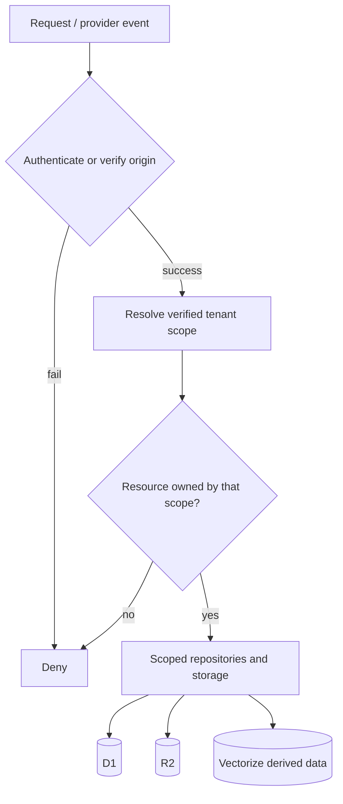

# Architecture and tenant isolation

## Core invariant

Tenant identity is an authorisation property, not user-controlled routing metadata.

In prose: a request/event is authenticated before a tenant is trusted; the resource must belong to that verified scope; only then may tenant-scoped repository/storage interfaces reach D1/R2/derived vectors.

## Current source state

Phase 1 migrations qualify core ownership by `tenant_id`, including users, groups, tickets, articles, attachments, memberships and support-email configuration. Composite tenant-qualified relationships prevent same-shaped identifiers in another tenant from satisfying ownership references.

R2 keys and Vectorize IDs do not independently grant access. Retention code deliberately retains ownership/manifests until R2/vector cleanup succeeds, so failed external deletion remains retryable.

The real-time endpoint verifies the operator/admin token before routing to a Durable Object named by the verified tenant.

## External channels and automation

Provider path fields, webhook payloads and automation rule contents never establish tenant authority. Each integration must authenticate/verify its connection and resolve a stored tenant ownership mapping before canonical conversation processing.

## Privacy metadata boundary

Future FidesLang privacy metadata is descriptive governance metadata, not an access-control mechanism. Missing or disabled privacy tooling must never weaken tenant isolation.

## Evidence

Detailed implementation/review evidence remains in the repository under [`docs/architecture/multitenancy/`](https://github.com/nathcymru/Tocyn/tree/main/docs/architecture/multitenancy).
