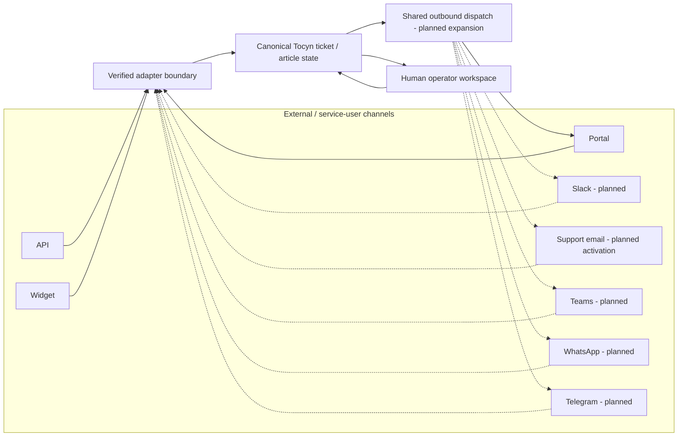

# Channel adapter architecture

The approved target [system overview](https://github.com/nathcymru/Tocyn/blob/main/docs/architecture/system-overview.md) places these channel paths alongside the shared headless browser surfaces and distinct ingress, consumer and outbound-dispatch responsibilities. API/portal-first release sequencing does not narrow the omnichannel architecture.

Accepted post-beta direction is implementation pending. Every provider UI is planned to render through the persistent operator workspace and shared composer; provider-specific inboxes are not an accepted architecture. See [ADR-0017](https://github.com/nathcymru/Tocyn/blob/main/docs/adr/ADR-0017-persistent-operator-workspace.md), [ADR-0020](https://github.com/nathcymru/Tocyn/blob/main/docs/adr/ADR-0020-human-led-ai-assistance.md) and [ADR-0027](https://github.com/nathcymru/Tocyn/blob/main/docs/adr/ADR-0027-linked-work-and-workflow-continuity.md).

## Principle

External messaging systems are adapters around Tocyn's canonical ticket/conversation state. They must not create parallel helpdesk models or make provider-specific identifiers the source of tenant authority.

The first private beta intentionally validates the canonical API/portal path before adding Slack to the critical path. Slack, support email, Teams, WhatsApp and Telegram are later integration milestones.

The implemented API/portal field contract and its local verification boundary
are documented in [Canonical conversation contract](https://github.com/nathcymru/Tocyn/blob/main/docs/architecture/canonical-conversation-contract.md).

Solid lines represent paths already present in the repository at some level; dashed provider paths represent approved future/adaptor work and must not be read as deployment claims.

## Canonical boundary

A provider adapter should normalise enough information to preserve, where applicable:

- verified tenant/connection identity;
- provider/channel type;
- external conversation and message identifiers;
- participants and message direction;
- message body and attachment references;
- timestamps and deduplication keys;
- threading/topic/reply context;
- delivery state and provider errors;
- correlation to Tocyn ticket/article records.

Provider-specific data can be retained as adapter metadata where necessary, but the operator workspace should not require a different ticket model for each channel.

## Authentication before normalisation

Normalisation happens **after** the provider boundary has been authenticated/verified. For example, a Telegram path parameter naming a tenant does not authorise the event; the connection secret and stored ownership mapping must establish that relationship. Equivalent rules apply to signed webhooks, OAuth installations and support-email routing.

## Retry and deduplication

External systems can retry, reorder or ambiguously acknowledge messages. Adapters therefore need provider-scoped idempotency/deduplication and a durable outbound lifecycle. A transport response should not be represented as delivered unless the provider semantics support that conclusion.

The approved shared ingestion/dispatch work is owned by roadmap issues #87/#88 and related integration issues. Provider-specific behaviour belongs in the relevant M7 milestone rather than leaking into the core conversation model.

Backend adapter contracts may progress independently. User-facing channel acceptance still requires the shared workspace/composer capability contract, contextual channel restrictions, draft preservation and tenant-isolation evidence; this does not pull all M7 providers into the next operator gate.

## Email boundaries

Tocyn treats two email concerns separately:

1. **transactional/authentication mail transport** — currently implemented through an injectable transport with Resend configuration;
2. **helpdesk support-email conversations** — inbound verification, tenant routing, threading and bidirectional canonical conversation behaviour.

Migrating authentication mail to another transport does not automatically implement support-email conversations, and support-email architecture must not be made dependent on that migration without a real technical requirement.

## Integration acceptance pattern

Every external channel should eventually demonstrate:

`authenticated inbound event → verified tenant → canonical Tocyn conversation → operator reply → correct outbound channel/context → auditable state`

Negative tests should include invalid credentials/signatures, cross-tenant mapping attempts, duplicate events, provider rate limits/outages and disabled/revoked connections.
