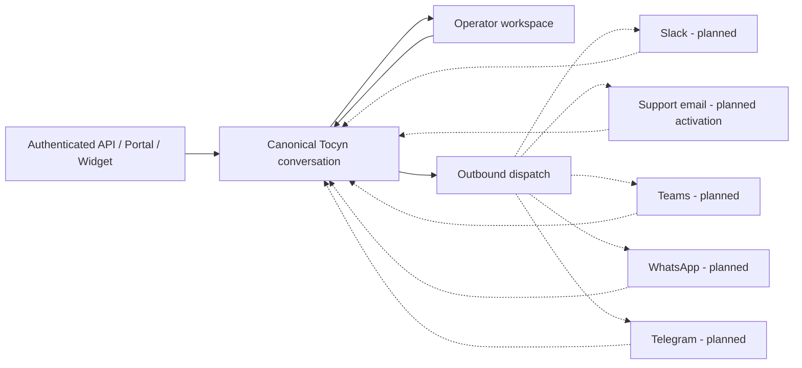

# Channels and conversation model

The approved target [[System-architecture]] places these channel paths alongside the shared headless browser surfaces and distinct ingress, consumer and outbound-dispatch responsibilities. API/portal-first release sequencing does not narrow the omnichannel architecture.

Tocyn's helpdesk core is channel-independent. External providers are adapters around canonical Tocyn ticket/article/conversation state rather than separate ticket systems.

Solid lines show current core application paths; dashed lines are approved future channel adapters.

## Adapter rules

Each provider adapter must:

- authenticate/verify the provider boundary before tenant resolution;
- map provider events to a stored tenant-owned connection;
- preserve provider conversation/message/thread/topic identifiers without treating them as authority;
- normalise content into canonical ticket/article state;
- deduplicate retries and preserve delivery uncertainty honestly;
- route operator replies back to the correct provider context;
- fail safely on revoked credentials, invalid signatures, rate limits and provider outages.

## First-beta sequencing

The first private beta is API/portal-first and human-led. Slack is deliberately not a first-beta blocker because no Slack adapter existed when the roadmap was approved. The beta proves the canonical conversation and human fallback before additional adapters increase the integration surface.

## Email is two capabilities

Transactional/authentication mail transport and helpdesk support-email conversations are separate capabilities. The current injectable mail transport/Resend configuration does not by itself mean inbound/outbound helpdesk email is complete. See ADR-0013.

Repository detail: [`docs/architecture/channel-adapters.md`](https://github.com/nathcymru/Tocyn/blob/main/docs/architecture/channel-adapters.md).
