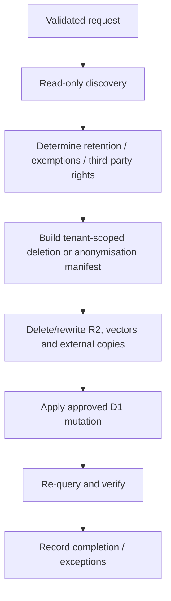

# GDPR_COMPLIANCE_USER_GUIDE

> **Technical guidance, not legal advice.** Tocyn does not make a deployment GDPR-compliant. Deployers must determine their own controller/processor role, lawful bases, notices, contracts, retention, security measures, rights-request decisions and exemptions. Recheck current ICO/regulator guidance before live use.

## Current metadata status

FidesLang declarations are planned under #16/#17 but are not yet present in `main`. Until implemented, use Tocyn's actual schema/storage inventory rather than assuming an automated privacy map exists.

## Article 15 — subject-access discovery

After verifying requester identity/authority and the tenant, use parameterised, read-only tenant-scoped queries.

```sql
SELECT tenant_id, id, email, full_name, role, created_at, last_login_at
FROM users
WHERE tenant_id = ?
  AND lower(trim(email)) = lower(trim(?));
```

Then find tickets by both user ID and customer email because a correspondent may not have a user account:

```sql
SELECT id, ticket_no, subject, status, priority, customer_id, customer_email,
       assigned_to, group_id, source, source_email, custom_fields,
       created_at, updated_at
FROM tickets
WHERE tenant_id = ?
  AND (customer_id = ? OR lower(trim(customer_email)) = lower(trim(?)));
```

Retrieve messages/articles and attachments only from the same verified tenant. `body_r2_key` and attachment `r2_key` values identify external objects but are not authority to retrieve them.

```sql
SELECT id, ticket_id, sender_id, sender_type, body, body_r2_key, snippet,
       raw_email_id, qa_type, chunk_count, is_internal, created_at
FROM articles
WHERE tenant_id = ? AND ticket_id IN (/* verified ticket IDs */);

SELECT id, article_id, file_name, file_size, content_type, r2_key, created_at
FROM attachments
WHERE tenant_id = ? AND article_id IN (/* verified article IDs */);
```

Human disclosure review is still required: internal notes, another person's information, secrets, privileged material or an applicable exemption cannot be solved by SQL alone.

Also inventory Vectorize-derived content, mail/channel providers, configured integrations, logs and backups as applicable to the deployment.

## Article 17 — erasure/anonymisation

The right to erasure is not absolute. Do not expose a generic “delete by email” endpoint.



The key operational rule is to preserve the authoritative cleanup manifest until external-object deletion succeeds. Tocyn's current retention service already follows this pattern for R2/vector side effects.

A safe implementation may anonymise retained ticket history rather than blindly cascade-delete it, for example only after an authorised plan:

```sql
UPDATE tickets
SET customer_id = NULL,
    customer_email = 'erased-subject@invalid.example',
    source_email = NULL
WHERE tenant_id = ? AND id IN (/* approved ticket IDs */);
```

This is an example, not a complete deletion script. Build a tested domain workflow that accounts for foreign keys, audit requirements, attachments, article bodies, vectors and external providers.

## Future FidesLang-assisted flow

Once #16/#17 are implemented, an orchestrator may parse validated data-category/data-subject/data-use declarations, identify likely data locations, bind them to tenant-scoped adapters and create a candidate DSAR plan. It still must not decide legal entitlement or grant credentials/tenant authority.

## RoPA starter inventory

| Data area | Typical information | Main Tocyn location | Deployment decision required |
| --- | --- | --- | --- |
| Account identity | email, name, role, IDs | D1 | account purpose/retention |
| Authentication/security | password hash, MFA state/secret, session/activity metadata | D1 + deployment logs | security retention and secret handling |
| Groups/permissions | membership/role relationships | D1 | organisational/security purpose |
| Tickets | subject, status, priority, customer/assignee, source, custom fields | D1 | support purpose and retention |
| Messages/notes | body, sender, snippets, internal-note state | D1 and/or R2 | content/retention/disclosure policy |
| Attachments | metadata and uploaded bytes | D1 + R2 | file retention and security |
| Email/channel identifiers | addresses, provider/thread/message identifiers | D1 + provider | provider/transfer/retention assessment |
| API/automation | key metadata, rule conditions/action configuration | D1 | admin/security purpose |
| Knowledge/AI | documents, QA content, embeddings/context | D1/R2/Vectorize/Workers AI | purpose, provider and retention |
| Audit/operations | actor IDs, timestamps, actions/security metadata | D1/provider logs | accountability/security retention |

Free text, custom fields, knowledge files and attachments can contain categories not structurally required by Tocyn, including special-category or third-party information. Assess actual use/content, not just column names.

## Security boundary

Privacy administration must remain behind Tocyn's normal authentication, authorisation and tenant isolation. An email address, tenant path, privacy request or FidesLang tag is never sufficient authority.

Report unsafe privacy endpoints or cross-tenant disclosure via [`SECURITY.md`](https://github.com/nathcymru/Tocyn/blob/main/SECURITY.md).

## Full repository guide

The repository-backed guide contains the complete checklist and examples: [`docs/privacy/gdpr-compliance-user-guide.md`](https://github.com/nathcymru/Tocyn/blob/main/docs/privacy/gdpr-compliance-user-guide.md).

Current UK reference points:
- ICO right of access guidance: https://ico.org.uk/for-organisations/uk-gdpr-guidance-and-resources/individual-rights/right-of-access/
- ICO right to erasure guidance: https://ico.org.uk/for-organisations/uk-gdpr-guidance-and-resources/individual-rights/individual-rights/right-to-erasure/
- ICO Article 30/documentation guidance: https://ico.org.uk/for-organisations/uk-gdpr-guidance-and-resources/accountability-and-governance/documentation/
