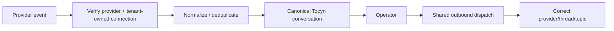

> Historical planning evidence. Superseded for active sequencing by [[Post-beta-master-baseline]]. Original dates and scope below are preserved, not current instructions.

# Omnichannel implementation roadmap

## Architectural rule

External channels plug into Tocyn's canonical ticket/conversation model through authenticated adapters. Provider payloads and provider identifiers do not create a separate helpdesk model or confer tenant authority.

## Current sequencing

1. **API/portal first beta** — prove tenant isolation, canonical conversation persistence, operator handling and reply path with human operators.
2. **Shared adapter foundations** — canonical provider-event normalisation, durable outbound dispatch/recovery and relevant telemetry.
3. **Slack** — first substantial external bidirectional messaging adapter after the API/portal beta.
4. **Support email / Teams / WhatsApp / Telegram** — deliver through their M7 milestones and shared adapter contracts, with safe parallel work where dependencies permit.
5. **Cross-channel continuity** — preserve a service-user conversation across verified channel changes without weakening identity/tenant boundaries.

The exact ordering after the first beta can move with real dependency/provider evidence; milestone architecture should not be rewritten merely to produce a prettier sequence.

## M7 integration milestones

| Milestone | Capability | Approved target forecast |
| --- | --- | --- |
| M7.1 | WhatsApp | 3 April 2027 |
| M7.2 | Telegram | 8 April 2027 |
| M7.3 | Slack | 23 January 2027 |
| M7.4 | Microsoft Teams | 31 March 2027 |
| M7.5 | Support Email | 4 February 2027 |

These are capacity forecasts, not deployment commitments.

## Shared acceptance pattern

In prose: each integration authenticates the provider/tenant connection first, normalises/deduplicates the event into canonical Tocyn state, presents it to the operator, then dispatches the reply to the verified original provider context.

## Tracker

Issue #49 is the cross-roadmap omnichannel tracker. It deliberately has no architectural milestone so completion of all channel work does not keep M1.2 artificially open.

## Email note

Authentication/transactional mail and support-email conversations are separate capabilities ([ADR-0013](ADR-0013-email-capability-boundaries)). Cloudflare-native authentication-mail migration is not automatically a prerequisite for the support-email channel.
