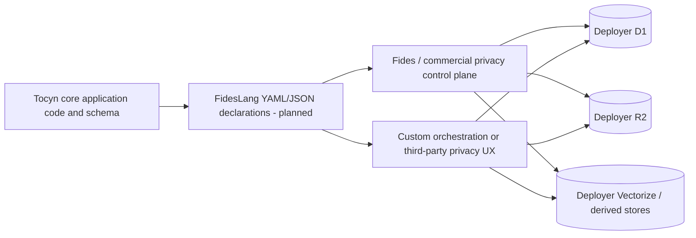
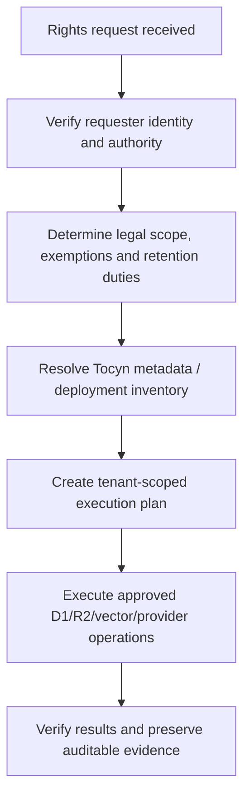

# Privacy architecture

## Purpose and current status

This page describes Tocyn's **technical privacy architecture** and the approved direction for privacy-as-code metadata. It does not create a compliance certification.

**Current implementation status (8 September 2026):** the inspected `main` branch contains tenant-scoped data/storage controls and retention cleanup, but it does **not** yet contain FidesLang declarations. Issues [#16](https://github.com/nathcymru/Tocyn/issues/16) and [#17](https://github.com/nathcymru/Tocyn/issues/17) own measurable FidesLang coverage and optional user controls under M5.4.

Accordingly, the FidesLang sections below describe the **approved target architecture**, not a feature that deployers can rely on today.

The accepted post-beta operator directions are likewise implementation pending. Planned drafts, attention state, notifications, linked work, contextual knowledge, feedback evidence and workspace preferences must use the same tenant/user-scoped storage and retention boundaries described here. They do not create a new access-control or residency authority.

## Privacy metadata is not access control

Tocyn separates two concerns:

1. **security/authorisation** decides whether an actor can access or mutate a tenant resource;
2. **privacy metadata** describes what data exists, whose data it may represent and why it is processed so external/privacy tooling can reason about it.

FidesLang must never become a prerequisite for tenant isolation. Disabling optional privacy tooling, losing a metadata file or misclassifying a field must not make an unauthorised operation succeed.

## Approved FidesLang declaration model

The planned metadata layer will use version-controlled declarations to describe privacy-relevant application inventory using a FidesLang-compatible taxonomy, including:

- **data categories** — what kind of information a field/storage object represents;
- **data subjects** — whose information it relates to;
- **data uses** — why Tocyn/deployers process it;
- representation/taxonomy version and validation evidence;
- explicit coverage numerator/denominator and justified exclusions.

Declarations must use architecture/schema metadata and synthetic examples. Tenant/customer data must not be copied into the repository or development-agent context merely to classify it.

## Interoperability paths

Once the declarations exist, deployers may consume them through more than one orchestration approach.

The diagram shows metadata interoperability. Tocyn code/schema is annotated or mapped to planned FidesLang declarations. A deployer can either ingest those declarations into a Fides-based privacy control plane (**Path A**) or parse them using a custom/proprietary/third-party orchestration layer (**Path B**). In both paths, actual DSAR/deletion operations target the deployer's own D1/R2/Vectorize and other connected systems under the deployer's credentials and policies.

### Path A — Fides-based control plane

A deployer may map Tocyn's declarations into a Fides deployment or compatible commercial privacy engineering solution. Tocyn does not bundle, host or operate that control plane. The deployer remains responsible for configuring identities, credentials, policies, scopes, legal decision logic and verification.

### Path B — custom or third-party orchestration

A deployer may instead parse the declarations using its own scripts, governance platform or privacy UX. The declaration format should remain sufficiently explicit/versioned that this does not require scraping free-text documentation.

## Data-location implications

Privacy operations cannot be reduced to one SQL table:

- **D1** holds tenant-qualified relational records such as users, tickets, articles, attachment metadata and configuration;
- **R2** can hold attachment bytes and offloaded article bodies;
- **Vectorize** can hold derived knowledge/QA vectors;
- external mail/channel/privacy systems may hold copies or delivery metadata outside Tocyn;
- backups/logs or downstream integrations are deployment-specific and must be inventoried by the deployer.

Current retention code already demonstrates the required cleanup principle: external R2/vector deletion is attempted before the database ownership manifest is discarded, so failed cleanup can be retried without losing what must be removed.

## Privacy-right orchestration boundary

Tocyn metadata should help answer **where relevant data may be**, but it must not decide whether a particular legal request is valid or whether an exemption/retention duty applies. A deployer must verify identity, determine scope/lawful outcome and then execute only the authorised technical operations.

The prose equivalent is: legal validation precedes technical orchestration; metadata identifies likely systems/records; the resulting plan is tenant-scoped; execution covers all relevant stores; and the deployer verifies/document results.

## Security requirements

Any privacy administration interface or orchestration credential must remain behind Tocyn's primary authentication, authorisation and tenant boundaries. Privacy tooling must not accept a tenant identifier, email address or FidesLang declaration as sufficient authority to retrieve/delete data.

Report flaws involving privacy metadata exposure, unsafe orchestration or cross-tenant access through [SECURITY.md](https://github.com/nathcymru/Tocyn/blob/main/SECURITY.md).

## Implementation roadmap

- **#16** — define representation/taxonomy/version, inventory applicable processing, measurable coverage and majority validated coverage;
- **#17** — complete coverage, regression validation, optional controls and migration guidance;
- **M5.4** — privacy metadata and controls architectural milestone.

Until those issues are completed and released, documents/examples should say **planned** rather than implying FidesLang is active.

The same status language applies to ADR-0016 through ADR-0028: accepted direction is not implemented capability. In particular, durable drafts, activity, SLA/ownership state and linked operational context require issue-owned schema/API work, retention decisions and tenant-isolation evidence before they may be described as available.

## Operational guide

See [GDPR compliance user guide](https://github.com/nathcymru/Tocyn/blob/main/docs/privacy/gdpr-compliance-user-guide.md) for tenant-scoped inventory, access/erasure pipeline examples and a RoPA starter table.
