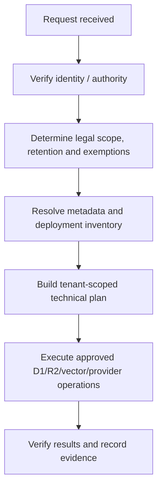

# PRIVACY_ARCHITECTURE

## Scope

This page is Tocyn's technical privacy-engineering blueprint for deployers. It is **not** a privacy notice for an independently deployed helpdesk and does not certify GDPR compliance.

**Current status, 8 September 2026:** Tocyn has tenant-scoped data/storage controls and retention cleanup, but FidesLang declarations are **not yet implemented in `main`**. Issues #16/#17 own measurable FidesLang coverage and optional controls under M5.4.

## Security and privacy metadata are separate

Authentication, authorisation and verified tenant scope decide who may access a resource. Future FidesLang metadata describes data categories, subjects and uses. Privacy metadata never grants access and cannot weaken tenant isolation if absent, disabled or malformed.

## Approved FidesLang interoperability

The diagram represents two approved consumption paths **after** #16/#17 are implemented. Path A imports Tocyn's version-controlled privacy declarations into a Fides-based privacy control plane. Path B allows a deployer to parse the same declarations with custom/proprietary/third-party orchestration. Both paths operate against the deployer's own systems and credentials; Tocyn does not host the privacy control plane.

Planned declarations will cover:

- data categories — what information is represented;
- data subjects — whose information it may be;
- data uses — why it is processed;
- taxonomy/version and validation evidence;
- measurable inventory coverage and exclusions.

Development metadata/examples must use schema/architecture information and synthetic examples, not real tenant data.

## Data locations a privacy workflow must consider

Tocyn personal data can span more than D1:

- D1 relational rows: accounts, groups, tickets, messages/articles, attachment metadata, support/channel configuration and audit/operational records;
- R2: attachment bytes and offloaded article bodies;
- Vectorize: derived knowledge/QA vectors where configured;
- external providers: mail/channel/webhook systems configured by the deployer;
- deployment-specific logs/backups/monitoring.

Current retention code demonstrates the required cleanup principle: external R2/vector side effects are removed before the database ownership manifest is discarded, so failed cleanup remains retryable.

## Rights-request control flow

Privacy metadata helps locate data; it does not decide whether a legal request must be granted. Legal validation precedes technical execution, and every operation remains tenant-scoped and authenticated.

## Implementation roadmap

- #16 — define FidesLang representation/taxonomy/version, inventory privacy-relevant processing, report coverage and implement validated majority coverage;
- #17 — complete coverage, regression checks, optional enable/disable controls and migration guidance;
- M5.4 — Privacy Metadata & Controls.

Until those issues are released, downstream documentation should say **planned** rather than implying an active FidesLang layer.

## Operational guide

See [[GDPR_COMPLIANCE_USER_GUIDE]] for Article 15/17 discovery/erasure examples and a RoPA starter inventory.

Repository canonical source: [`docs/privacy/privacy-architecture.md`](https://github.com/nathcymru/Tocyn/blob/main/docs/privacy/privacy-architecture.md).

Security concerns involving privacy orchestration, policy exposure or cross-tenant access must be reported under [`SECURITY.md`](https://github.com/nathcymru/Tocyn/blob/main/SECURITY.md).
