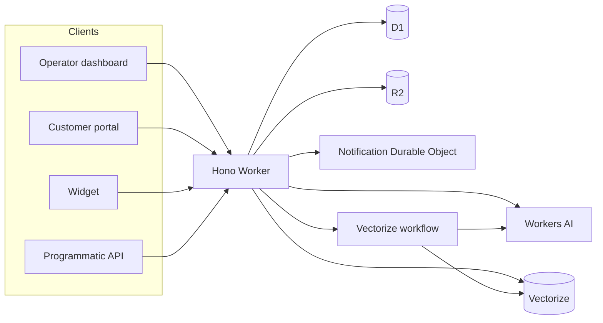

# System architecture

## Status

Tocyn is pre-release. The current repository contains a Hono-based Cloudflare Worker backend plus dashboard, portal and widget applications. Phase 1 tenant-qualified ownership is implemented in source; isolated private-beta deployment and production cutover remain separate gates.

## Current runtime arrangement

In prose: all current application surfaces call the API Worker. D1 owns relational records; R2 holds attachments/offloaded bodies; the tenant-keyed Durable Object coordinates real-time operator connections; Workers AI/Vectorize support knowledge/AI functions; and a Cloudflare Workflow supports vectorisation. Current `wrangler.json` has no Queue or Cloudflare Calls binding, so those are not presented as deployed services.

## Request authority

Before request-driven code accesses tenant-owned state it must derive a verified tenant scope from authenticated credentials or a verified external connection. A tenant ID in a URL/body/webhook is not authority.

## Current versus planned

**Implemented/foundation:** API/portal/widget, ticket/article state, auth/permissions, tenant-qualified ownership, D1/R2, Durable Object realtime, Workers AI/Vectorize foundations, injectable mail transport.

**Approved / planned:** isolated preview/beta/production environments, external channel adapters, support-email activation, expanded operator UX, FidesLang metadata, policy-gated autonomous backend actions, production readiness.

## More detail

Repository technical source: [`docs/architecture/system-overview.md`](https://github.com/nathcymru/Tocyn/blob/main/docs/architecture/system-overview.md).
