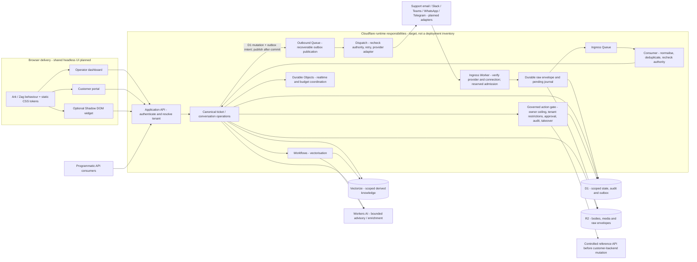
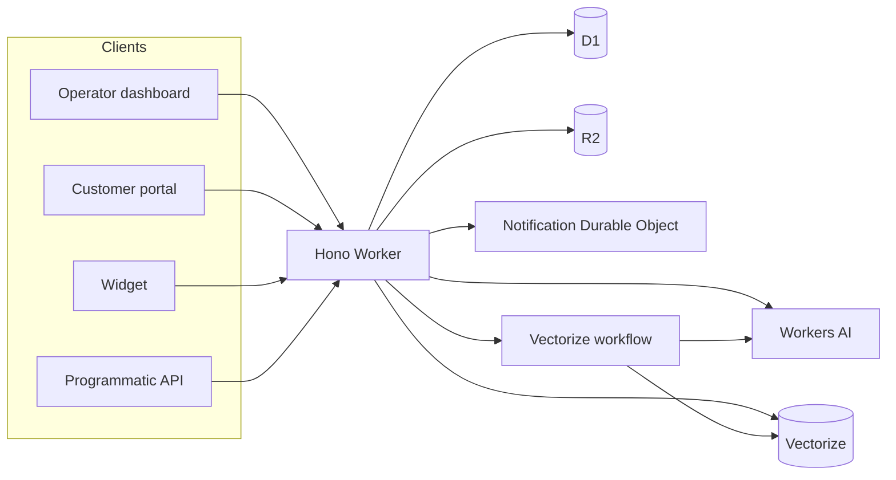

# System architecture

Tocyn is being built as an omnichannel, multi-tenant helpdesk: service users contact support through a portal, embedded widget, programmatic API or external channel, while human operators work in one canonical conversation workspace. Bounded AI assistance and governed autonomous workflows extend that shared model; they do not create a separate helpdesk or bypass human control.

## Approved target architecture

**Approved / planned target, not a claim that every component is implemented or deployed.** The principal diagram shows the accepted system boundaries. The delivery-status section below identifies the current foundations and remaining work.

The dashboard, portal and optional widgets share planned Ark/Zag behavioural primitives with extendable TypeScript interfaces, static CSS and standard `--tocyn-*` custom properties. Tenant tokens apply at the document/container boundary; the Web Component wrapper isolates widget CSS in Shadow DOM while exposing the defined token API. Standalone operation never requires custom-element registration. Browser UI stays outside API Worker bundles; runtime CSS-in-JS is forbidden (#48/#66/#67).

API consumers authenticate at the application API. Support email, Slack, Teams, WhatsApp and Telegram enter through verified provider/connection adapters. Ingress reserves capacity, durably records bounded raw envelopes and a recoverable journal, then acknowledges using provider-specific semantics. Queues carry compact references to a consumer that normalises and deduplicates before canonical ticket/conversation writes. D1 owns scoped relational state, audit and transactional outbound intent; R2 owns bodies/media/raw content. Recoverable outbox publication feeds a separate dispatch responsibility for provider replies, bounded retries and authority rechecks (#51/#87/#88/#91).

These are distinct application API, edge-ingress, asynchronous-consumer and outbound-dispatch runtime responsibilities, not one synchronous Worker request. The accepted work establishes their contracts and Queue boundaries; it does **not** yet fix a deployment-wide Worker count or mandate particular Worker-to-Worker Service Binding/RPC wiring. Any direct internal service call must preserve verified tenant/correlation context and recheck the receiving operation's authority; a service boundary or tenant path is never permission by itself. Resource placement and concrete binding choices remain implementation decisions within those contracts.

Durable Objects supply realtime coordination and approved quota coordination, never memory-only durable acceptance. Workers AI and Vectorize support bounded enrichment/knowledge assistance, with Workflows for vectorisation. Persist accepted content before optional AI. Governed operations additionally require the deployment-owner ceiling, tenant restrictions, operation-bound approval where required, verification, attributable audit and takeover fencing; the first mutation proof uses the controlled reference API (#80–#83, ADR-0010). No diagram arrow grants cross-tenant data access or autonomous authority.

Target authority: [headless primitives #48](https://github.com/nathcymru/Tocyn/issues/48), [omnichannel tracker #49](https://github.com/nathcymru/Tocyn/issues/49), [durable ingress #51](https://github.com/nathcymru/Tocyn/issues/51), [consumer #87](https://github.com/nathcymru/Tocyn/issues/87), [dispatch #88](https://github.com/nathcymru/Tocyn/issues/88), [recovery #91](https://github.com/nathcymru/Tocyn/issues/91) and [accepted ADRs](https://github.com/nathcymru/Tocyn/wiki/Architecture-decision-records).

## Delivery status

| Classification | Evidence / remaining work |
| --- | --- |
| **Implemented foundations** | Dashboard/portal/widget and Hono API; auth/permissions, tenant-qualified state, D1/R2, realtime Durable Object, Workers AI/Vectorize and vectorisation Workflow; injectable mail transport. This is source evidence, not production clearance. |
| **In progress / remaining acceptance** | Phase 1 tenant ownership has merged implementation; #19 retains cross-tenant acceptance work. A merged foundation is not completion of the wider target. |
| **Approved / planned; not yet implemented as the target** | Ark/Zag migration, tenant token API and reusable Shadow DOM wrapper; shared durable ingress/Queues/consumer/outbox; external adapters and canonical cross-channel continuity; governed autonomous reference execution. |
| **Separate deployment gates** | Isolated beta environments/rehearsal and production readiness. Provider setup and infrastructure deployment are not implied by source, ADRs or this diagram. |

The local human-led API/portal beta was accepted on 9 September 2026 at
`049ea82a02571681f834bcd87d43253603edf71f` and formally published as
`v0.4.0-beta.1` on 10 September 2026 with PR #125 evidence. It used synthetic data
and local mail capture; no remote application deployment occurred. Future `beta.2`
requires the Operator Workspace gate, including full SLA clocks/pause-resume,
waiting treatment and responsible-handler ownership/routing. #42 production/
cutover readiness remains separate.

## Current implementation / runtime

Tocyn is pre-release. The current repository contains a Hono-based Cloudflare Worker backend plus dashboard, portal and widget applications. Phase 1 tenant-qualified ownership is implemented in source; isolated private-beta deployment and production cutover remain separate gates.

## Current runtime arrangement

In the current implementation, all application surfaces call the API Worker. D1 owns relational records; R2 holds attachments/offloaded bodies; the tenant-keyed Durable Object coordinates real-time operator connections; Workers AI/Vectorize support knowledge/AI functions; and a Cloudflare Workflow supports vectorisation. Current `wrangler.json` has no Queue or Cloudflare Calls binding, so those are not presented as deployed services.

## Request authority

Before request-driven code accesses tenant-owned state it must derive a verified tenant scope from authenticated credentials or a verified external connection. A tenant ID in a URL/body/webhook is not authority.

## Current versus planned

**Implemented/foundation:** API/portal/widget, ticket/article state, auth/permissions, tenant-qualified ownership, D1/R2, Durable Object realtime, Workers AI/Vectorize foundations, injectable mail transport.

**Approved / planned:** isolated preview/beta/production environments, external channel adapters, support-email activation, expanded operator UX, FidesLang metadata, policy-gated autonomous backend actions, production readiness.

The accepted ADR-0016–ADR-0028 direction is implementation pending. Workspace
continuity, durable attention, cognitive accessibility, human-led AI, observability,
residency, realtime support sessions, governed applets, tenant knowledge, workforce
identity, linked work and bounded feedback are planned under their mirrored ADR pages.

## More detail

Repository technical source: [`docs/architecture/system-overview.md`](https://github.com/nathcymru/Tocyn/blob/main/docs/architecture/system-overview.md).

## Residency source validation (#160)

The [deployment residency contract](https://github.com/nathcymru/Tocyn/blob/main/docs/deployment-residency.md) and preview/beta manifests now distinguish storage, HTTP, asynchronous, AI/provider and observability paths. Local release preparation validates these fields and carries them into its binding manifest. Current evidence is pending/unknown; no live jurisdiction guarantee or legal compliance is claimed. The current generator rejects hard profiles because its bindings do not implement jurisdiction-aware provisioning. Production #42 and future remote #57 must verify resource creation-time jurisdiction, processing paths and migration consequences before any constrained deployment. Tenant/request metadata cannot select a deployment region.
